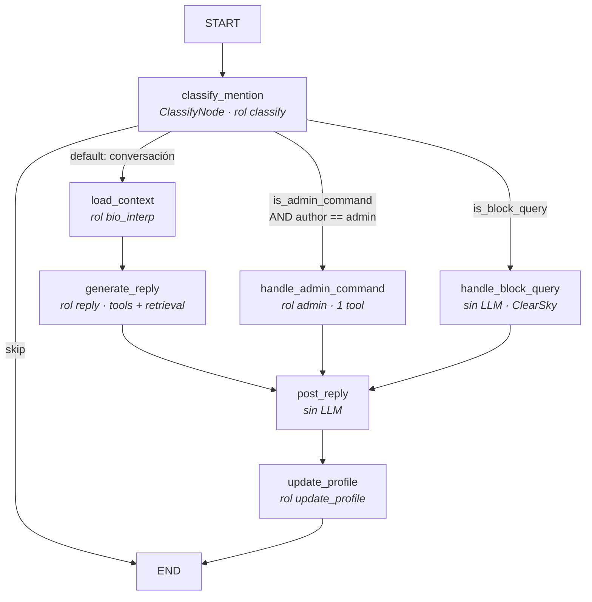

# Arquitectura de Botata

> Documento de referencia para entender el sistema completo. Actualizado al cierre de M6
> (2026-07-11, tareas T1–T29 salvo T19/T20/T28). El estado de tareas vive en `ROADMAP.md`;
> las decisiones y su porqué, en `CLAUDE.md`. Este documento explica **cómo funciona el código**.

## 1. Qué es Botata

Botata es un bot comunitario de Bluesky construido como **agente**: no es un script que
reacciona con plantillas, sino un sistema donde un LLM decide — qué responder, si postear,
qué herramienta usar, qué recordar de cada persona. La refundación de `maripobot.py` (un
monolito sin estructura) sobre cuatro pilares:

1. **Grafos de estado (`langgraph`)** para los flujos de decisión.
2. **SQLite como única fuente de verdad**, con búsqueda semántica local (sqlite-vec + FTS5).
3. **Herramientas declarativas** (registry propio + conectores MCP externos).
4. **Comportamiento configurable en archivos**, no en código (prompts, skills, settings).

Principios que atraviesan todo (de `CLAUDE.md`): código minimalista, tipado estricto,
nada de clases innecesarias, todo toggle en config, y **ningún prompt hardcodeado** en `.py`.

## 2. Mapa de módulos

```
botata.py        ← el corazón: grafos, nodos, BskyClient, pases, loop, CLI (~3000 líneas)
db.py               ← persistencia: esquema, embeddings, búsqueda híbrida, eventos, catálogo
router.py           ← ruteo de modelos LLM por rol, con fallbacks entre endpoints
tools.py            ← framework de tools (registry + scopes), agnóstico de la app
skills.py           ← workspace de comportamiento en markdown (T26)
scheduler.py        ← registro de tareas periódicas del loop (T27)
mcp_tools.py        ← cliente MCP: conectores externos → tools (T29)
mcp_servers/        ← servers MCP propios (reddit_server.py; futuros: x, ig)
browser.py          ← navegador stealth (patchright, perfil persistente) para scraping
sources.py          ← adaptadores de scraping por plataforma (IGSource; X pendiente)
ig_api.py           ← Instagram vía API privada mobile (alternativa sin navegador)
clearsky.py         ← "quién me bloquea" (API pública de ClearSky)
catalog.py          ← CLI: cataloga imágenes scrapeadas con un modelo de visión
mem_admin.py        ← CLI: administrar la memoria (facts/lecciones) a mano
config_ui.py + ui/  ← panel web local (127.0.0.1) para editar settings/.env/news/skills (T22)
migrate_maripobot.py← migración one-off desde el bot viejo (idempotente)
prompts/            ← todos los prompts del sistema (T23: nunca inline en .py)
skills/             ← skills en markdown, editables en caliente
config/             ← settings.json (config central) + news_sites.json + credenciales gitignored
context/            ← SOUL.md (personalidad) + MEMORY.md (memoria general del bot)
posted/botata.db ← LA base de datos (gitignored; sync por rclone)
tests/              ← pytest, ~170 tests, sin red salvo E2E marcados
scripts/            ← sync de credenciales/DB, snapshot WAL, pipeline de chats a Obsidian
```

La regla de dependencias: los módulos de infra (`tools`, `skills`, `scheduler`, `mcp_tools`,
`router`, `db`) **no importan botata** — definen contratos genéricos. `botata.py` los
cablea. Eso permite testearlos aislados y, a futuro (M7), reutilizarlos con otro canal.

## 3. Arranque y configuración

### Import de botata.py (orden)

1. Logging a stdout (nivel INFO).
2. Paths: `CONFIG_DIR`, `CONTEXT_DIR`, `PROMPTS_DIR`, `SKILLS_DIR`, `POSTED_DIR`; crea `posted/`.
3. `load_dotenv(.env)` — credenciales.
4. Timezone Argentina (`ZoneInfo` con fallback UTC-3 fijo; Windows no trae tzdata del SO).
5. `settings = load_json(config/settings.json)` → constantes de módulo:
   `BSKY_HANDLE`, `ADMIN_HANDLE`, `POLL_INTERVAL`, `FEEDS_CONFIG`, `TOOLS_CONFIG`,
   `MCP_CONFIG`, `TASKS_CONFIG`, `MODELS_CONFIG`, `NEWS_ENABLED`, `NEWS_SOURCES`.

**Env vars obligatorias** (el import falla sin ellas): `BSKY_PASSWORD`, `OPENROUTER_API_KEY`.
**Opcionales por feature**: `BRAVE_API_KEY` (web_search), `SPOTIFY_CLIENT_ID/SECRET`
(search_music), `YOUTUBE_API_KEY` (share_video), `IG_*` (scraping IG).

### settings.json — secciones

| Sección | Qué controla | Consumidor |
|---|---|---|
| `BOT_HANDLE` / `ADMIN_HANDLE` | identidad y gate de admin | todo el sistema |
| `MODELS` | endpoints/aliases/roles del router | `router.py` |
| `FEEDS[]` | fuentes proactivas (list/feed/following) + política + intervalo | grafo de feed |
| `TOOLS` | enable/scopes por tool | `ToolRegistry.apply_config` |
| `TASKS` | enable/intervalo por tarea periódica | `scheduler.apply_tasks_config` |
| `MCP` | servers MCP externos (transport/command/filtros) | `mcp_tools` |
| `NEWS_ENABLED` | master toggle de noticias RSS | `run_news_pass` |

### run(mode) — el runtime

```
init_db() → BskyClient (login con retry) → build_router → build_graph (menciones)
→ build_tool_registry (tools nativas + MCP) → build_feed_graph → retry_stuck_mentions
→ registrar PeriodicTasks → while True: run_due(tasks); sleep(POLL_INTERVAL)
```

Modos: `open` (responde a todos) / `admin_only` (ignora no-admins, registrándolos).

## 4. El grafo de menciones (flujo reactivo)

Es el corazón conversacional. Una mención entra y sale un reply, con memoria actualizada.



### El estado (`MentionState`, TypedDict)

Inmutable de entrada: `mention_uri/cid/text`, `author_handle`, `thread_context` (cadena de
parents reconstruida), `thread_root_uri/cid`, `mode`, `is_admin`. Los nodos van agregando:
`classification`, `reply_text`, `image_path`, `posted_reply_uri`, `error`.

### Los nodos, uno por uno

- **ClassifyNode** (modelo lite): structured output `MentionClassification` con
  `is_admin_command` + `command`, `skip` (spam/sin sentido), `is_block_query`. Ante error
  del LLM devuelve clasificación neutra — la conversación sigue como default.
  La *ruta* la decide `route_after_classify`, no el nodo. Importante: `/bloques` va **antes**
  del gate de admin (cualquier usuario puede preguntarlo); los comandos admin exigen
  clasificación **y** que `author == ADMIN_HANDLE` (validado contra settings, no el LLM).
- **LoadContextNode**: asegura la fila en `users`. Si el usuario es nuevo, ingiere su bio:
  la baja de Bluesky, la interpreta con `interpret_bio_prompt.md` y siembra `user_facts`.
  No "carga contexto" para el reply — eso es retrieval del siguiente nodo.
- **GenerateReplyNode** (modelo reasoning) — el nodo más rico. Compone el system prompt:

  ```
  SOUL.md (personalidad)
  + fecha/hora actual en AR (T3 — sin esto el LLM alucinaba "hoy" desde la memoria)
  + MEMORY.md (memoria general del bot)
  + hechos del usuario     ← hybrid_search_user_facts(handle, query, k=5)
  + lecciones de conducta  ← hybrid_search_lessons(query, k=5)
  + skills (índice + inline, scope reply — T26)
  + resumen del catálogo de imágenes
  [ fase de tools: si el LLM llama tools scope reply, se ejecutan y su
    resultado se suma al contexto ]
  + reply_format.md
  ```

  La query del retrieval es `thread_context + mention_text` — lo que se está hablando.
  Después de la fase de tools hace el `complete()` final con structured output `BotReply`.
- **HandleAdminCommandNode** (rol admin): expone las tools scope `admin` vía tool-calling,
  ejecuta **la primera** que el LLM invoque y usa su resultado directamente como reply.
  Es un dispatcher de comandos, no un conversador. (Esta restricción de "una tool, sin
  encadenar" es la razón de que las skills admin se inyecten completas — ver §9.)
- **HandleBlockQueryNode** (sin LLM): resuelve el DID, consulta ClearSky (con cache TTL en
  DB), y formatea la lista de bloqueadores en ≤300 chars. Determinístico a propósito.
- **PostReplyNode**: postea vía `BskyClient.reply` (con imagen opcional), marca el estado
  en `replied_posts` (`replied`/`failed`) y loguea en `bot_posts`.
- **UpdateProfileNode** (rol reasoning): después de responder, relee la conversación entera
  y extrae hechos nuevos autorrevelados → `upsert_user_fact` (con dedup semántico). Corre
  en todos los caminos que postean; si no hay nada nuevo el LLM contesta `NADA`.

### Orquestación e idempotencia

- `process_mention`: gate de dedup por `has_replied(uri)` (tabla `replied_posts` — la DB es
  la fuente de verdad, no el "visto" de Bluesky, que es global y poco confiable).
- `retry_stuck_mentions` (al arranque): los `pending` de un run que murió pasan a `failed`
  y se reintenta cada `failed` refetcheando el post por URI (la poll normal solo ve las
  últimas 25 notificaciones; sin esto, una mención fallida vieja se perdía para siempre).

## 5. El grafo de feed (flujo proactivo)

El bot no solo responde: lee el feed de la comunidad y decide si tiene algo que decir.

```mermaid
graph TD
    A[START] --> F[fetch<br/><i>gate de intervalo + fetch posts</i>]
    F -->|sin posts| Z[END]
    F -->|hay posts| L[learn<br/><i>hechos + eventos → memoria (T6)</i>]
    L --> S[summarize<br/><i>rol feed_summary</i>]
    S -->|sin resumen| Z
    S --> R[reflect<br/><i>rol feed_opinion · DECIDE</i>]
    R -->|no vale la pena| Z
    R -->|should_post| P[post<br/><i>dedup + postea</i>]
    P --> Z
```

- **FetchFeedNode**: respeta `interval_hours` por feed (cursor en `feed_cursors`); soporta
  3 tipos de fuente (`list` / `feed` generator / `following`) vía el dispatcher
  `BskyClient.get_feed_posts`.
- **LearnFromFeedNode** (T6): corre *siempre* que haya posts, independiente de si se postea.
  Extrae `FeedLearnings`: hechos autorrevelados (solo de usuarios que ya tienen perfil —
  gate `user_exists`, para no acumular datos de desconocidos) y eventos con fecha (van a
  `events`; si el dueño no tiene perfil, el evento queda como "de comunidad").
- **ReflectDecideNode** — el núcleo agéntico (T5). Recibe SOUL + fecha + resumen + la
  **política de posteo** del feed (`conservative`/`balanced`/`active`, cada una un prompt
  en `prompts/feed_policy_*.md`) + sus propios posts recientes (anti-repetición) + skills +
  tools scope `feed_reflection` (puede buscar en la web, mirar el calendario, buscar música).
  Devuelve `FeedDecision {should_post, reason, text, image_query}`. La razón queda logueada.
- **PostFeedNode**: guardia de duplicados **normalizada** contra `bot_posts` (case, espacios)
  e imagen autónoma opcional (T12, con guardrail: jamás postea una imagen sin descripción).

## 6. Persistencia y memoria (db.py)

### La base

SQLite en `posted/botata.db`, modo **WAL** (lecturas no bloquean escrituras),
`foreign_keys=ON`, conexión compartida con `check_same_thread=False` (langgraph ejecuta
nodos en hilos). El esquema completo está en `CLAUDE.md`; las tablas por responsabilidad:

| Tabla | Rol |
|---|---|
| `users` | identidad: handle (PK de negocio), did, bio cruda + interpretada |
| `user_facts` (+`_vec`, `_fts`) | hechos por usuario, con embedding y texto indexado |
| `lessons` (+`_vec`, `_fts`) | lecciones de conducta cross-usuario |
| `events` | calendario (handle NULL = evento de comunidad) |
| `bot_posts` | todo lo que el bot publicó (log de salida; dedup y "qué dije") |
| `replied_posts` | idempotencia de entrada (pending/replied/failed/ignored) |
| `feed_cursors` | cursores genéricos clave→timestamp (feeds, news:host, task:name) |
| `image_catalog` (+`_vec`, `_fts`) | imágenes scrapeadas descritas por el modelo de visión |
| `relationships` | grafo social ponderado (schema listo, aún sin poblar — ver Neo4J en CLAUDE.md) |
| `posted_news`, `clearsky_cache`, `scraped_items` | dedup/cache de subsistemas |

### Embeddings

`BAAI/bge-m3` (1024 dims, multilingüe, bueno en rioplatense), corriendo **local en CPU**
vía sentence-transformers. Carga lazy: el modelo (~2GB) recién se descarga/carga al primer
`embed()` — los tests de esquema no lo necesitan. Cero costo por inferencia, cero red,
privacidad de los datos de usuarios.

### Búsqueda híbrida (la pieza clave del contexto)

Cada búsqueda corre **dos rankings en paralelo** y los fusiona:

1. **Semántico**: KNN coseno en la tabla `vec0` (sqlite-vec). `user_facts_vec` está
   **particionada por handle** — la búsqueda de hechos de un usuario nunca se contamina
   con hechos de otro.
2. **Keyword**: BM25 en FTS5 — rescata lo que el semántico pierde: handles, nombres
   propios, términos exactos.
3. **Fusión RRF** (Reciprocal Rank Fusion): `score(doc) = Σ 1/(60 + rank)` sobre cada
   lista donde el doc aparece. Simple, sin pesos que tunear, y robusto: un doc que está
   razonablemente arriba en ambas listas le gana a uno que domina una sola.

### Escritura con dedup semántico

`upsert_user_fact` / `upsert_lesson`: antes de insertar, busca el vecino más cercano
(en la partición del usuario / en el mismo scope). Si coseno ≥ **0.92** → es un duplicado,
no inserta. El threshold es deliberadamente conservador: no mergea paráfrasis lejanas
(bajarlo a ~0.85 si se quiere dedup más agresivo). Esto hace **idempotentes** a todos los
flujos de aprendizaje: releer el mismo feed no duplica memoria.

### Purga (privacidad)

`purge_user_memory(handle, include_relationships, drop_profile)`: borra hechos + embeddings
(los vectores vec0 se borran a mano — el FK cascade no los cubre) + eventos propios.
Es la base de `/resetme` (T11: solo memoria) y `/blockme` (T10: block + purga total).

## 7. Router de modelos (router.py)

Tres capas de indirección para no casarse con ningún proveedor:

```
roles  (función del bot: reply, classify, feed_opinion, ...)
  ↓ apunta a
aliases (cadena ordenada de fallback: reasoning, lite, vision)
  ↓ cada entrada es
endpoints (cualquier API OpenAI-compatible: OpenRouter, Ollama local, ...)
```

Los nodos piden por **rol** (`RoleLLM(router, "reply")`); el router recorre la cadena del
alias con reintentos y backoff, y loguea qué endpoint sirvió. Config actual: DeepSeek v4
pro/flash por OpenRouter con fallback a Ollama local (`qwen3-32b` en la LAN). Caveat
conocido: Ollama no respeta `guided_json`, así que los structured outputs son menos
confiables si un rol cae al fallback local.

`RoleLLM` expone tres verbos: `complete(system, user, PydanticModel?)` (con structured
output opcional), `call_with_tools(system, user, schemas)` (una ronda de tool-calling:
devuelve texto o tool_calls, **sin loop de feedback**) y `chat`.

> Nota de diseño: el tool-calling es de **una sola ronda** en todo el sistema. Los nodos
> ejecutan las tools que el LLM pidió, inyectan los resultados al contexto y hacen un
> `complete()` final aparte. No hay agente loop multi-turno — decisión de simplicidad.

## 8. Sistema de tools (tools.py)

`ToolRegistry`: cada tool se declara una vez con schema OpenAI + handler + **scopes** +
toggle. Los scopes son los tres contextos de ejecución:

- `reply` — respondiendo menciones (usuarios): superficie pública, la más sensible.
- `feed_reflection` — el loop proactivo decidiendo si postear.
- `admin` — comandos del administrador.

El grafo arma la lista disponible en runtime filtrando por scope+enabled. `settings.json →
TOOLS` puede override-ar enable y scopes por nombre sin tocar código. El contrato del
handler: `(args: dict, ctx: ToolContext) → ToolResult(text, image_path?)`. Los handlers
viven en `botata.py` y se cierran sobre lo que necesitan (bsky, router, conn).

Tools actuales (por scope predominante): `web_search` (Brave), `get_upcoming_events` /
`create_event` (calendario), `summarize_feed` / `get_my_recent_posts` / `get_news` /
`search_music` (Spotify) / `share_video` (YouTube) / `use_skill` / `reset_my_memory` /
`block_me` (reply); `save_to_user_profile` / `save_to_memory` / `search_images` /
`get_debug_info` / `get_help` (admin).

**Config por comandos (T30):** el admin ajusta la configuración desde Bluesky con 6 tools
scope `admin` (`get_bot_config` + `set_{tool,task,feed}_config`, `set_news_enabled`,
`set_mcp_enabled`). Doble efecto: persisten a settings.json (validado + atómico, releyendo
el disco para no pisar a la UI de T22) y aplican **en vivo** sobre los objetos que el loop
consulta. **Locks** (doble capa: handler + `_delta_guard` en la persistencia) — regla
general: *por comando solo se reduce exposición, nunca se amplía*: identidad
(`BOT_HANDLE`/`ADMIN_HANDLE`), `MODELS` + endpoints/modelos legacy (anti-exfiltración:
redirigir el endpoint LLM filtrarían prompts y memoria), estructura de MCP, las tools de
config a sí mismas (anti auto-lockout), la tarea `mentions` (es el canal de los comandos)
y **agregar scopes `reply`/`feed_reflection` a cualquier tool** — ampliar la superficie
pública se hace solo desde la UI local.

## 9. Skills (skills.py, T26)

Comportamiento **temático** en `skills/*.md`, editable en caliente (la carpeta se relee en
cada pase — mismo patrón que SOUL/MEMORY, sin cache). Frontmatter = config (`name`,
`description`, `scopes`, `enabled`, `inline`); no hay sección en settings.json.

La selección es **agéntica y barata**: el system prompt lleva solo un índice
(`name: description` por skill); si el tema coincide, el agente llama `use_skill(name)` y
el cuerpo entra al contexto. `inline: true` fuerza el cuerpo al prompt (para guías que el
agente no sabría pedir). Excepción: en el contexto **admin** todo va inline, porque ese
flujo ejecuta una sola tool y usa su resultado como respuesta (un `use_skill` ahí devolvería
la skill como reply).

Separación conceptual: **SOUL.md** = quién es el bot, siempre. **Skills** = qué hacer
cuando se habla de X. Seguridad: el cuerpo entra al system prompt del bot público — solo
el admin escribe en `skills/`.

## 10. Cliente MCP y servers (mcp_tools.py + mcp_servers/, T29)

Botata consume **MCP servers externos** como tools: la sección `MCP` de settings declara
servers (stdio o streamable-http); al arranque el cliente conecta, lista sus tools y las
registra en el ToolRegistry como `{server}_{tool}` con un handler proxy. Un conector nuevo
(Google Calendar, un scraper, lo que sea) es config, no código.

Detalles que importan:

- **`MCPBridge`**: el SDK MCP es async; el bridge corre un event loop en un thread daemon.
  Cada server vive en una *task dedicada* que abre y cierra sus propios context managers —
  los cancel scopes de anyio no pueden cruzarse de task (gotcha real del SDK). Sesiones
  persistentes, shutdown por `atexit`.
- **Regla de seguridad**: las tools MCP nacen con scope `admin`. Promoverlas a `reply` es
  opt-in explícito — el bot es público y una tool en scope reply es invocable por cualquier
  desconocido vía prompt injection.
- **Degradación**: server caído al arranque → warning y se omite; error en un call →
  `ToolResult` de error, jamás excepción (el flujo admin ejecuta sin try/except).
- **Lazy**: sin sección `MCP` en settings, el SDK ni se importa.

Servers declarados (ambos `enabled:false` hoy): **`reddit`** (propio,
`mcp_servers/reddit_server.py`: RSS/Atom con rate limiter interno de 61s — Reddit limita a
1 req/min por IP — cache 10 min y retry con `Retry-After`) y **`browser`** (el oficial
`@playwright/mcp` de Microsoft vía npx, headless + perfil en RAM + tool_filter a
navigate/snapshot; requiere Node 18+). La plantilla para servers futuros es
`tests/mcp_echo_server.py` (~25 líneas con FastMCP).

## 11. Scheduler y pases proactivos (scheduler.py, T27)

El loop de `run()` es genérico: una lista de `PeriodicTask(name, fn, interval_hours,
enabled)` + `run_due()` + sleep. Dos modos de cadencia:

- `interval_hours = 0` → corre **cada iteración**; la tarea se gatea sola por dentro
  (caso feed —intervalo por feed—, news —intervalo por fuente—, poll de menciones).
- `interval_hours > 0` → gate del scheduler vía cursor `task:{name}` en `feed_cursors`.

Los errores se aíslan **por tarea** (una tarea rota no frena el poll de menciones);
`KeyboardInterrupt` atraviesa y corta el loop. Config en `settings.json → TASKS`.

Tareas registradas:

| Tarea | Qué hace | Default |
|---|---|---|
| `feed` | grafo proactivo por cada feed configurado | on |
| `news` | RSS de noticias por fuente (`mode: comment\|post`, dedup `posted_news`) | on (pero `NEWS_ENABLED:false` manda) |
| `mentions` | poll + proceso de menciones | on |
| `heartbeat` | pase de calendario agéntico | **off**, 12h |

**Heartbeat**: lee `events_today` + `upcoming_events` + instrucciones en dos capas:
`prompts/heartbeat_checklist.md` (default versionado, editable a mano — el mecanismo principal) y
`context/heartbeat_override.md` (override runtime que escribe el comando `set_heartbeat` — auxiliar,
lo pisa temporalmente; borrarlo vuelve al default). Sin eventos NI instrucciones en ninguna
capa, no llama al LLM (costo cero). Con material, compone SOUL + fecha + `heartbeat_engine.md`
+ skills + instrucciones + eventos + posts recientes, y decide con `FeedDecision`. Imágenes
autónomas (T12): si hay catálogo, ofrece `image_query` y adjunta vía `resolve_catalog_image`
(mismo guardrail que el feed); toggle `TASKS.heartbeat.autonomous_images`, default **true**
(las instrucciones del heartbeat ya son del admin, a diferencia de los feeds opt-in). Reparto
estilo OpenClaw (un archivo = un rol): `heartbeat_engine.md` = SOLO invariantes del pase
(regla dura anti-alucinación de eventos, **jamás** eventos personales no celebrables,
anti-spam, callar es digno, formato); las tareas viven en la checklist `prompts/heartbeat_checklist.md`
(ítem 1 hoy: calendario) — editarla reemplaza la conducta de verdad, sin criterio duplicado
en el marco.
Verificado en vivo: saluda una vez y a la pasada siguiente se niega a repetirse.

## 12. BskyClient (la capa de plataforma)

Único punto de contacto con Bluesky (~370 líneas dentro de botata.py). Métodos clave:

- **Entrada**: `get_mentions()` (últimas 25 notifs mention/reply; no filtra por `is_read` —
  el dedup es de la DB), `get_thread_info(uri)` (reconstruye la cadena de parents como
  contexto + root del thread), `get_mention_by_uri` (para reintentos).
- **Salida**: `post(text, image_path?)` y `reply(text, parent, root, image_path?)`. Ambos
  construyen **facets de links** siempre (Bluesky no autodetecta URLs: hay que declarar
  offsets en bytes UTF-8) y, si hay un link y no hay imagen, arman la **tarjeta de preview**
  (`AppBskyEmbedExternal` con OpenGraph + thumbnail subido como blob; YouTube va por oEmbed
  porque le sirve página de consentimiento a los bots). Truncado inteligente a 300 chars.
- **Feeds**: `get_feed_posts(type, id, since)` — dispatcher sobre `get_list_feed` /
  `get_custom_feed` / `get_timeline`, con paginación común (cap 5 páginas, corta en `since`).
- **Moderación**: `block_user(handle)` (para `/blockme`).
- **Robustez**: login con timeout explícito (15s connect / 30s read) y 4 reintentos con
  backoff exponencial — un hipo de red en el arranque no mata el proceso.

Para M7 (multicanal), esta clase es el molde de la futura interfaz `Channel`: todo lo que
el grafo necesita de una plataforma pasa por acá.

## 13. Scraping (browser.py, sources.py, ig_api.py, catalog.py)

Subsistema separado del runtime del bot (corre por CLI, alimenta el catálogo):

- **browser.py**: navegador anti-detección con **patchright** (Chromium parcheado a nivel
  binario: sin `navigator.webdriver`, sin leak de `Runtime.enable`, TLS fingerprint real).
  Modelo de sesión: login manual headful **una vez** → el perfil persistente guarda la
  sesión → la automatización la reúsa headless para siempre. No sabe de plataformas.
- **sources.py**: adaptadores por plataforma (`Source` ABC → `fetch_recent`). `IGSource`
  implementado (meta tags OG como estrategia primaria, LLM extractor de fallback).
  X/Twitter es un stub (T19). Reddit ya **no** pasa por acá: es el MCP server.
- **ig_api.py**: camino alternativo para IG vía instagrapi (API privada mobile, sin
  navegador). Interfaz intercambiable con IGSource.
- **catalog.py** (CLI `sync`/`stats`): toma las imágenes scrapeadas (y la carpeta
  `manual/`), las describe con el modelo de visión (categoría, descripción, tags, OCR) y
  las indexa en `image_catalog` con embedding — de ahí salen las imágenes que el bot
  adjunta (con el guardrail: sin descripción válida, no se postea).

## 14. Testing

`pytest` (+ tests stdlib legacy), **~171 tests, <10s**, sin tocar la red (los E2E de MCP
spawnean procesos locales; el de Reddit usa fixtures). Convenciones:

- `sys.path.insert` + env dummies (`BSKY_PASSWORD`, `OPENROUTER_API_KEY`) **antes** de
  `import botata` (el import las exige).
- Mocks por `monkeypatch.setattr` sobre los globals del módulo; DB real temporal
  (`d.init_db(tmp_path/...)`) para lo que toca esquema.
- Los tests de retrieval con embeddings reales existen pero el grueso usa vectores dummy.

Correr: `pytest` desde la raíz. Un archivo: `pytest tests/test_skills.py -v`.

## 15. Operación

- **Entrypoints CLI**: `python botata.py` (loop completo; `--mode open|admin_only`) ·
  `--proactive [--force-post]` (pase de feed one-shot) · `--news` · `--heartbeat` ·
  `--fetch-feeds [--backfill]` · `--post-summary <feed>`. Satélites: `mem_admin.py`,
  `catalog.py`, `scrape_ig.py`, `migrate_maripobot.py`.
- **Panel de configuración** (`python config_ui.py`, T22): UI web solo-localhost (stdlib,
  cero deps) sobre settings.json/.env/news_sites.json/skills. Credenciales write-only
  (la API nunca devuelve valores), validación server-side, escrituras atómicas con `.bak`.
  Settings/.env/news requieren reiniciar el bot; el toggle de skills es hot-reload.
  Es la UI del núcleo: las futuras UIs por canal serán interfaces separadas.
- **Credenciales**: nunca en el repo (verificado: `.env` y `config/{bluesky,instagram}.json`
  jamás entraron al historial). Viven en el repo hermano privado `butterbot-secrets` con
  scripts `pull`/`push`.
- **DB**: single-writer. Sync por rclone a Google Drive (`scripts/db-backup|restore`);
  `db_snapshot.py` usa la backup API de SQLite para copiar consistente aun con WAL activo.
- **Deploy**: desarrollo en Windows 11, producción en Linux Mint. Todo el código es
  portable (paths con `pathlib`, tz con fallback, stdlib donde se pudo). Requisito nuevo
  para prod: Node 18+ si se activa el server `browser`.

## 16. Cómo extender el sistema (recetas)

- **Tool nueva**: handler `(args, ctx) → ToolResult` en botata.py + `reg.register(...)`
  en `build_tool_registry` (schema + scopes) + entrada en `settings.json → TOOLS`. Test.
- **Skill nueva**: crear `skills/nombre.md` con frontmatter. Nada más — se carga sola.
- **Tarea periódica nueva**: función del pase + `PeriodicTask` en la lista de `run()` +
  entrada en `TASKS`. Si se auto-gatea, interval 0; si no, interval del scheduler.
- **Conector externo**: si existe un MCP server (oficial o de terceros), es una entrada en
  `settings.json → MCP`. Si no existe, escribirlo con FastMCP en `mcp_servers/` (~50-150
  líneas; plantillas: `tests/mcp_echo_server.py` y `mcp_servers/reddit_server.py`).
  Regla: scope `admin` hasta que se decida lo contrario.
- **Prompt nuevo**: siempre archivo en `prompts/`, cargado con `load_text` (T23).
- **Canal nuevo (M7, futuro)**: extraer de `BskyClient` la interfaz `Channel`
  (mentions/post/reply/thread/perfil normalizado); el grafo no debe saber en qué red habla.
  El orden decidido: Bluesky → Mastodon → Discord → Telegram → WhatsApp.

## 17. Límites conocidos y deuda deliberada

- **Tool-calling de una ronda**: el LLM no puede encadenar tools ni reaccionar al resultado
  de una tool con otra. Suficiente hoy; revisar si las tools se vuelven composicionales.
- **`botata.py` es grande** (~3000 líneas): BskyClient, nodos, pases y CLI conviven.
  La extracción natural (BskyClient → `channel_bsky.py`) conviene hacerla **como parte de
  T28**, no antes, para no refactorizar dos veces.
- **Sin reconexión en caliente de MCP**: server muerto en runtime → cada call devuelve
  error graceful; reconectar = reiniciar el bot.
- **Ollama fallback sin guided_json**: structured outputs degradados si OpenRouter cae.
- **`relationships` sin poblar**: el schema del grafo social existe, pero nada escribe en
  él todavía (la decisión Neo4J-vs-SQLite está en CLAUDE.md: diferida).
- **`FeedProcessor` legacy** convive con el grafo proactivo (lo usan `--fetch-feeds` y
  `--post-summary`); candidato a borrarse cuando esos caminos se porten.
- **Validaciones en vivo pendientes**: T10 `/blockme` y T11 `/resetme` nunca se ejecutaron
  contra prod (necesitan cuenta descartable). Toggles apagados esperando al admin:
  `reddit`, `browser`, `heartbeat`, `NEWS_ENABLED`.
