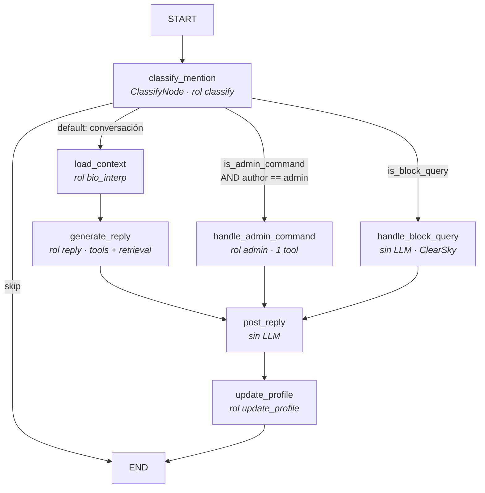

# Arquitectura de Botata

> Documento de referencia para entender el sistema completo. Actualizado a la fase de
> lanzamiento (2026-08-03, milestones M1–M11: núcleo agéntico, instancias, canales, rutinas,
> multimodal). El estado de tareas vive en `ROADMAP.md`. Este documento explica **cómo
> funciona el código**.

## 1. Qué es Botata

Botata es un bot comunitario multi-canal construido como **agente**: no es un script que
reacciona con plantillas, sino un sistema donde un LLM decide — qué responder, si postear,
qué herramienta usar, qué recordar de cada persona. La refundación de `maripobot.py` (un
monolito sin estructura) sobre cuatro pilares:

1. **Grafos de estado (`langgraph`)** para los flujos de decisión.
2. **SQLite como única fuente de verdad**, con búsqueda semántica local (sqlite-vec + FTS5).
3. **Herramientas declarativas** (registry propio + conectores MCP externos).
4. **Comportamiento configurable en archivos**, no en código (prompts, skills, settings).

Principios que atraviesan todo (de `CLAUDE.md`): código minimalista, tipado estricto,
nada de clases innecesarias, todo toggle en config, y **ningún prompt hardcodeado** en `.py`.

## 2. Mapa de módulos

Todos los módulos Python viven en **`src/`** (layout src, desde 2026-07-20; la raíz quedó sin
`.py` sueltos). Rutas del listado relativas a `src/`:

```
botata.py           ← el corazón: grafos, nodos, BskyClient, pases, loop, CLI (~8300 líneas)
channels.py         ← los otros canales: Mastodon, Discord y WhatsApp + contrato Channel
budget.py           ← presupuesto diario de tokens (BudgetGuard: duerme al bot si se quema)
db.py               ← persistencia: esquema, embeddings, búsqueda híbrida, eventos, catálogo
router.py           ← ruteo de modelos LLM por rol, con fallbacks entre endpoints
tools.py            ← framework de tools (registry + scopes), agnóstico de la app
skills.py           ← workspace de comportamiento en markdown (T26)
moods.py            ← estados de ánimo diarios (archivos de la instancia + máquina de estados)
routines.py         ← rutinas: conducta proactiva con cadencia en routines/*.md
scheduler.py        ← registro de tareas periódicas del loop (T27)
memory_compact.py   ← compactación de memoria/notas/hechos (T48/T48b/T49)
connectors.py       ← conectores de contenido declarativos (Pinterest, Tumblr, API genérica…)
mcp_tools.py        ← cliente MCP: conectores externos → tools (T29)
mcp_servers/        ← servers MCP propios (reddit_server.py)
instance.py + init_instance.py ← resolución de instancia (--instance) y alta desde plantilla
clearsky.py         ← "quién me bloquea" (API pública de ClearSky)
catalog.py          ← CLI: cataloga imágenes scrapeadas con un modelo de visión
mem_admin.py        ← CLI: administrar la memoria (facts/lecciones) a mano
config_ui.py + ui/  ← panel web local (127.0.0.1) para settings/.env/fuentes/skills/rutinas (T22)
prompts/ (template) ← todos los prompts del sistema viven en la instancia (T23: nunca inline)
bridges/whatsapp/   ← bridge de WhatsApp en Go (whatsmeow), binario único, HTTP local
instance_template/  ← TODA la identidad default de una instancia nueva
tests/              ← pytest, ~1160 tests, <40s, sin red salvo E2E marcados
scripts/            ← sync de credenciales/DB, snapshot WAL, pipeline de chats a Obsidian
```

El scraping (adquisición de media) vive en la suite aparte **Membrilla**
(`pablofprz/membrilla`); Botata consume su salida por carpeta + sidecar JSON vía `catalog.py`.

Cada bot es una **instancia** (`bots/<nombre>/`, gitignored): su `config/settings.json`,
su `.env`, sus `prompts/`, `skills/`, `moods/`, `routines/`, `context/` (SOUL.md y memoria)
y su DB en `posted/botata.db`. El motor no tiene identidad propia: sin `--instance` (o
`BOTATA_INSTANCE`) el proceso corta.

La regla de dependencias: los módulos de infra (`tools`, `skills`, `scheduler`, `mcp_tools`,
`router`, `db`) **no importan botata** — definen contratos genéricos. `botata.py` los
cablea. Eso permite testearlos aislados y, a futuro (M7), reutilizarlos con otro canal.

## 3. Arranque y configuración

### Import de src/botata.py (orden)

1. Logging a stdout (nivel INFO).
2. Paths: `CONFIG_DIR`, `CONTEXT_DIR`, `PROMPTS_DIR`, `SKILLS_DIR`, `POSTED_DIR`; crea `posted/`.
3. `load_dotenv(.env)` — credenciales.
4. Timezone Argentina (`ZoneInfo` con fallback UTC-3 fijo; Windows no trae tzdata del SO).
5. `settings = load_json(config/settings.json)` → constantes de módulo:
   `BSKY_HANDLE`, `ADMIN_HANDLE`, `POLL_INTERVAL`, `FEEDS_CONFIG`, `TOOLS_CONFIG`,
   `MCP_CONFIG`, `TASKS_CONFIG`, `MODELS_CONFIG`, `NEWS_SOURCES`.

**Env vars obligatorias** (el import falla sin ellas): la credencial del canal
(`BSKY_PASSWORD` / `MASTODON_ACCESS_TOKEN` / `DISCORD_BOT_TOKEN` según `CHANNEL`) y
`LLM_API_KEY` (alias back-compat: `OPENROUTER_API_KEY`).
**Opcionales por feature**: `BRAVE_API_KEY` (web_search), `SPOTIFY_CLIENT_ID/SECRET`
(search_music), `YOUTUBE_API_KEY` (share_video), `TUMBLR_API_KEY` (get_latest_media).

### settings.json — secciones

| Sección | Qué controla | Consumidor |
|---|---|---|
| `BOT_HANDLE` / `ADMIN_HANDLE` | identidad y gate de admin | todo el sistema |
| `MODELS` | endpoints/aliases/roles del router | `router.py` |
| `FEEDS[]` | fuentes de LECTURA (list/feed/following/local/channel) + intervalo | grafo de feed |
| `TOOLS` | enable/scopes por tool | `ToolRegistry.apply_config` |
| `TASKS` | enable/intervalo por tarea periódica | `scheduler.apply_tasks_config` |
| `BOT_ACTIONS_FROM` + `BOT_ACTIONS_GROUPS` | quién puede agendarle acciones (`admin`\|`groups`\|`any`) | `_puede_agendar_acciones` |
| `MOODS` | apagado / fijo (`manual.fixed`) / auto + susceptibilidad e histéresis | `current_mood`, `run_mood_pass` |
| `MCP` | servers MCP externos (transport/command/filtros) | `mcp_tools` |
| `MEMBRILLA` | repo + comandos del scraper hermano (botón "Lanzar scraper" de la UI) | `config_ui.py` |

Además, **un registro único de fuentes** fuera de settings.json: `config/sources.json`
(T38/T38b) = `[{type, name, category, sources: [...], description, enabled}]`. Un **tema** con
las fuentes que le correspondan, y un `type` que dice por dónde entra cada una:

| `type` | `sources` contiene | Consumidor |
|---|---|---|
| `rss` | URLs de feeds | tool `get_news` |
| `membrilla` | `source_name` de Membrilla | tools `search_images` y `search_videos` (parámetro `topic`) |
| `spotify` | ids de playlist | tool `get_playlist_track` (parámetro `topic`) |
| `youtube` | canales (`@handle`, `UC…`) o listas (`PL…`) | tool `share_video` (parámetro `topic`) |
| `pinterest` | tableros `usuario/tablero` (RSS oficial, sin credenciales) | tool `get_latest_media` |
| `tumblr` | blogs (`blog` o `blog#tag`, API v2 + `TUMBLR_API_KEY`) | tool `get_latest_media` |
| `api` | cualquier API JSON, **descripta en la propia entrada** (T46) | `get_latest_media` (si mapea imagen) · `get_data` (si mapea otros campos) |

**Media vs datos (el mismo conector, 2026-07-30):** el tipo `api` exigía mapear
`image_url`, así que solo servía para fotos — y la mitad de lo que se habla en una
comunidad (el dólar, el clima, si hoy juega Boca) quedaba afuera, condenado a una
tool a medida por cada API. Ahora el `map` es **libre**: tres nombres siguen
teniendo significado (`image_url`, `url`, `title`) y el resto son campos que
elige el admin (`{"venta": "blue.venta"}`). Con `image_url` la entrada es de
media y la lee `get_latest_media`; sin él es de datos y la lee `get_data`, que
devuelve texto plano (`- [blue] compra: 1550 · venta: 1570`) para que el bot lo
comente con su voz — un JSON crudo en el prompt lo empuja a copiarlo tal cual.
`_entradas_en_vivo` filtra las de datos para que pedir una imagen no vaya a
buscar la cotización. Consecuencia práctica: sumar el dólar, el clima o los
feriados es cargar una fuente en la UI, no escribir un conector.

**Indexado vs en vivo (frontera a no confundir):** `membrilla` es contenido **indexado** —
Membrilla lo baja, `catalog.py` lo describe con visión y entra al motor de búsqueda semántica,
así que resuelve *"un meme de fútbol"*. `pinterest`/`tumblr`/`api` son conectores **en vivo**:
van a la fuente en el momento, sin descripción ni embedding. Conviven a propósito.

**Cómo se elige entre los dos (T47, 2026-07-28).** `search_images` mira los dos y **ninguno
tiene prioridad fija**: el catálogo aporta peso *semántico* (cada imagen la describió el modelo
de visión) y el registro de fuentes aporta peso de *admin* (si una entrada dice "mapaches", hay
una persona afirmando qué hay ahí). Tres piezas:
* **Umbral de relevancia** (`MEDIA_SEARCH.catalog_max_distance`, 0.47). La búsqueda híbrida
  siempre devuelve el vecino más cercano, así que "encontró algo" no es "encontró esto". Se
  corta por la **distancia coseno** (`vec_distance`, que `hybrid_search_image_catalog` ahora
  expone) — el score de RRF no sirve para esto: es rank-fusion, el primero saca ~2/61 aunque
  no tenga nada que ver. Calibrado midiendo el catálogo real: lo que está da 0.31–0.43, lo que
  no, 0.50–0.56. Un candidato también pasa si su **descripción dice literalmente** una palabra
  con contenido del pedido.
* **La query se limpia antes de buscar.** El envoltorio ("una foto de un … please") no aporta
  significado y **comprime las distancias** (la misma imagen: 0.503 con la palabra sola, 0.410
  con la frase entera), lo que dejaba pasar cualquier cosa bajo el umbral.
* **Relevancia antes que frescura.** `prefer_fresh_media` desempata **entre los que ya
  pasaron** el filtro; al revés, el "mejor" era el más nuevo y no el más parecido.
Si sirven los dos, decide `MEDIA_SEARCH.source_weight` (0.5 = moneda al aire; 0 o 1 fijan la
prioridad sin tocar código). El LLM puede forzar con `prefer: auto|catalogo|fuentes`, que es
preferencia y no mordaza: si el preferido no tiene nada, se usa el otro.

**Regla dura del pipeline de media:** una tool que encuentra una imagen devuelve `image_path`, y
**ese path tiene que llegar al post**. Cuando no llega, el LLM ve un resultado de tool que
promete una imagen que nunca aparece y termina **fingiendo el adjunto** — con una anotación
`[imagen: …]` o con un link markdown y una URL inventada. Por eso `strip_fake_media` corre en
los seis embudos de salida y `GenerateReplyNode` propaga `outcome.image_path` avisándole al
modelo que ya queda adjunta.

Todo se resuelve **en query** (el tema se matchea contra category/name/description/fuentes),
así editar el registro aplica en caliente sin reindexar. Permite varias playlists por tema,
varios diarios por sección y varios grupos de cuentas por tema. `add_music_recommendation`
escribe en **todas** las playlists que matcheen el tema, reportando por separado las que
rechazan la escritura (403 = playlist ajena a la cuenta autorizada). Los registros
viejos (`news_sites.json`, `content_sources.json`, `SPOTIFY_PLAYLIST_ID`) se migran solos.

### run(mode) — el runtime

```
init_db() → BskyClient (login con retry) → build_router → build_graph (menciones)
→ build_tool_registry (tools nativas + MCP) → build_feed_graph → retry_stuck_mentions
→ registrar PeriodicTasks → while True: run_due(tasks); sleep(POLL_INTERVAL)
```

Modos: `open` (responde a todos) / `admin_only` (ignora no-admins, registrándolos).

### Fecha y hora (por qué está donde está)

`soul_text()` — el único punto de carga del SOUL, por donde pasan todos los flujos
outward — **incluye** `current_datetime_line()`. Antes cada caller la sumaba a
mano y alcanzaba con que un flujo nuevo se olvidara para que el bot se perdiera en
los días. Los flujos que NO cargan el SOUL (clasificación, comando de admin,
resumen de feed, update de perfil, fase de tools del reply) la agregan aparte. En
`GenerateReplyNode` va **dos veces** a propósito: con el SOUL arriba y de nuevo al
final, porque ese prompt es largo (skills + hechos + charlas + hilo) y lo del
principio queda sepultado. La línea incluye el **día de la semana** (`_DIAS_ES`,
índice = `datetime.weekday()`, lunes=0) porque es lo que el bot usa para hablar
("lunes de Dio").

**Y la otra mitad del problema (2026-07-29):** la DB guarda con
`datetime('now')`, que en SQLite es **UTC**, mientras el bot vive en -3. Leía su
propia historia tres horas adelantada — a las 20:39 locales su último post decía
23:39 — y pasadas las 21:00 TODO lo que leía (posts, interacciones, memoria)
estaba fechado **al día siguiente**, contra una línea que decía "hoy es domingo".
Se arregla al RENDERIZAR con `fecha_local()` (no se toca lo guardado: mezclar
zonas en la misma columna sería peor). Un valor sin hora se devuelve tal cual —
"2026-07-21" ya es una fecha, y convertirla la correría un día para atrás.

## 4. El grafo de menciones (flujo reactivo)

Es el corazón conversacional. Una mención entra y sale un reply, con memoria actualizada.



### El estado (`MentionState`, TypedDict)

Inmutable de entrada: `mention_uri/cid/text`, `author_handle`, `thread_context` (cadena de
parents reconstruida), `thread_root_uri/cid`, `mode`, `is_admin`. Los nodos van agregando:
`classification`, `reply_text`, `image_path`, `posted_reply_uri`, `error`.

### Los nodos, uno por uno

- **ClassifyNode** (modelo lite): structured output `MentionClassification` con
  `is_admin_command` + `command`, `skip` (spam/sin sentido), `is_block_query`. Ante error
  del LLM devuelve clasificación neutra — la conversación sigue como default.
  La *ruta* la decide `route_after_classify`, no el nodo. Importante: `/bloques` va **antes**
  del gate de admin (cualquier usuario puede preguntarlo); los comandos admin exigen
  clasificación **y** que `author == ADMIN_HANDLE` (validado contra settings, no el LLM).
- **LoadContextNode**: asegura la fila en `users`. Si el usuario es nuevo, ingiere su bio:
  la baja de Bluesky, la interpreta con `interpret_bio_prompt.md` y siembra `user_facts`.
  No "carga contexto" para el reply — eso es retrieval del siguiente nodo.
- **GenerateReplyNode** (modelo reasoning) — el nodo más rico. Compone el system prompt:

  ```
  SOUL.md (personalidad)
  + fecha/hora actual en AR (T3 — sin esto el LLM alucinaba "hoy" desde la memoria)
  + MEMORY.md (memoria general del bot)
  + hechos del usuario     ← hybrid_search_user_facts(handle, query, k=5)
  + lecciones de conducta  ← hybrid_search_lessons(query, k=5)
  + skills (índice + inline, scope reply — T26)
  + resumen del catálogo de imágenes
  [ fase de tools: si el LLM llama tools scope reply, se ejecutan y su
    resultado se suma al contexto ]
  + reply_format.md
  ```

  La query del retrieval es `thread_context + mention_text` — lo que se está hablando.
  Después de la fase de tools hace el `complete()` final con structured output `BotReply`.
- **HandleAdminCommandNode** (rol admin): expone las tools scope `admin` vía tool-calling,
  ejecuta **la primera** que el LLM invoque y usa su resultado directamente como reply.
  Es un dispatcher de comandos, no un conversador. (Esta restricción de "una tool, sin
  encadenar" es la razón de que las skills admin se inyecten completas — ver §9.)
- **HandleBlockQueryNode** (sin LLM): resuelve el DID, consulta ClearSky (con cache TTL en
  DB), y formatea la lista de bloqueadores en ≤300 chars. Determinístico a propósito.
- **PostReplyNode**: postea vía `BskyClient.reply` (con imagen opcional), marca el estado
  en `replied_posts` (`replied`/`failed`) y loguea en `bot_posts`.
- **UpdateProfileNode** (rol reasoning): después de responder, relee la conversación entera
  y extrae hechos nuevos autorrevelados → `upsert_user_fact` (con dedup semántico). Corre
  en todos los caminos que postean; si no hay nada nuevo el LLM contesta `NADA`. Cuán
  selectivo ser lo calibra **`MEMORY_SUSCEPTIBILITY`** (0–1, default 0.3 = el histórico
  estricto; slider en la UI, "Memoria por usuario"): el valor se traduce en código a un
  bloque que se appendea al prompt de extracción — sin tocar las tres copias del prompt —
  con tramos mínimo / estricto / generoso / máximo. La nota de interacción se escribe
  siempre, a cualquier susceptibilidad (T57).

### Orquestación e idempotencia

- `process_mention`: gate de dedup por `has_replied(uri)` (tabla `replied_posts` — la DB es
  la fuente de verdad, no el "visto" de Bluesky, que es global y poco confiable).
- `retry_stuck_mentions` (al arranque): los `pending` de un run que murió pasan a `failed`
  y se reintenta cada `failed` refetcheando el post por URI (la poll normal solo ve las
  últimas 25 notificaciones; sin esto, una mención fallida vieja se perdía para siempre).

## 5. El grafo de feed (pase de LECTURA)

El bot lee el feed de la comunidad y aprende de él. **Nunca postea desde acá**
(2026-07-27, T28 fase 3d): opinar sobre lo leído es trabajo de las rutinas, que
consultan esta lectura vía `summarize_feed` y `context/feeds/*.md`.

```mermaid
graph TD
    A[START] --> F[fetch<br/><i>gate de intervalo + fetch posts</i>]
    F -->|sin posts| Z[END]
    F -->|hay posts| L[learn<br/><i>hechos + eventos → memoria (T6)</i>]
    L --> S[summarize<br/><i>rol feed_summary → context/feeds/*.md</i>]
    S --> Z
```

- **FetchFeedNode**: respeta `interval_hours` por feed (cursor en `feed_cursors`); soporta
  3 tipos de fuente (`list` / `feed` generator / `following`) vía el dispatcher
  `BskyClient.get_feed_posts`.
- **LearnFromFeedNode** (T6): corre *siempre* que haya posts, independiente de si se postea.
  Extrae `FeedLearnings`: hechos autorrevelados (solo de usuarios que ya tienen perfil —
  gate `user_exists`, para no acumular datos de desconocidos) y eventos con fecha (van a
  `events`; si el dueño no tiene perfil, el evento queda como "de comunidad").
- Esta lectura alimenta tres consumidores: la **memoria** (facts/eventos), la tool
  **`summarize_feed`** (resumen en vivo, scope reply+feed_reflection) y el **clima de
  moods** (disparadores temáticos). Los ex nodos de posteo (`ReflectDecideNode`/
  `PostFeedNode`, con su `posting_policy`) se eliminaron en T28 fase 3d.

## 6. Persistencia y memoria (db.py)

### La base

SQLite en `posted/botata.db`, modo **WAL** (lecturas no bloquean escrituras),
`foreign_keys=ON`, conexión compartida con `check_same_thread=False` (langgraph ejecuta
nodos en hilos). El esquema completo está en `CLAUDE.md`; las tablas por responsabilidad:

| Tabla | Rol |
|---|---|
| `users` | identidad: handle (PK de negocio), did, bio cruda + interpretada |
| `user_facts` (+`_vec`, `_fts`) | hechos por usuario, con embedding y texto indexado |
| `lessons` (+`_vec`, `_fts`) | lecciones de conducta cross-usuario |
| `events` | calendario (handle NULL = evento de comunidad) |
| `bot_posts` | todo lo que el bot publicó (log de salida; dedup y "qué dije") |
| `replied_posts` | idempotencia de entrada (pending/replied/failed/ignored) |
| `feed_cursors` | cursores genéricos clave→timestamp (feeds, news:host, task:name) |
| `image_catalog` (+`_vec`, `_fts`) | imágenes scrapeadas descritas por el modelo de visión |
| `relationships` | grafo social ponderado (schema listo, aún sin poblar — ver Neo4J en CLAUDE.md) |
| `bot_memory` | memoria general del bot — **se inyecta ENTERA en cada llamada** |
| `posted_news`, `clearsky_cache` | dedup/cache de subsistemas |

### Completa vs. retrieval (el corte que gobierna el costo del contexto)

No todas las memorias entran igual, y la diferencia decide qué crece y qué no:

* **Completas en cada prompt**: `bot_memory` y `preferences`. Su **largo es contexto
  gastado en todas las conversaciones**, y crecen sin techo (~4,5 filas/día medidas en
  producción → ~20k tokens por llamada a los 6 meses). Son las que necesitan compactación.
* **Por retrieval con k fijo**: `user_facts`, `lessons` (híbrida) e `interactions`
  (cronológica). **No saturan el contexto nunca**, tengan 600 filas o 600.000. Su problema
  al crecer es de **precisión**: más filas = más chance de que las k que salgan sean
  irrelevantes o se contradigan.

Confundir los dos lleva a optimizar lo que no duele. Un pase de compactación sobre
`user_facts` no ahorra un solo token de contexto; sobre `bot_memory`, todos.

**Cuánto trae el retrieval es config, no código** (`settings.RETRIEVAL`, T49c): `user_facts`,
`interactions`, `lessons` y los del hilo. Estaban hardcodeados en 5 y 3. Es la perilla que
gobierna el costo por mención del lado del retrieval, igual que `max_chars` lo gobierna del
lado de lo que entra completo.

### Los 📌 de cada persona (T49c)

`user_facts.pinned` marca lo que alguien **pidió** que el bot recuerde. Un hecho fijado:

* entra en **todas** las respuestas a esa persona, por afuera de la búsqueda;
* **no** compite por los k lugares del retrieval — `hybrid_search_user_facts` lo excluye a
  propósito. Si compitiera, fijar un hecho podría dejar afuera otro relevante, y encima lo
  que alguien pidió recordar quedaría sujeto a que la búsqueda lo encuentre, que es justo
  lo que fijarlo viene a evitar;
* **se puede fusionar, nunca descartar** (T49d). La inmunidad total duró un día: medido en
  producción, el 59% de los hechos terminó fijado y la compactación se quedó sin material —
  de 35 usuarios compactables a **4**—, con los duplicados peores congelados justamente por
  tener una punta 📌 (un usuario con **cuatro** filas diciendo que es de Chacarita, tres de
  ellas fijadas). Fusionar no pierde nada: la sucesora hereda el 📌 y el contenido, y
  `superseded_by` mantiene el undo. Descartar sí perdería, y sigue prohibido.

**Fijar es una decisión, no un efecto de cargar.** Por eso el alta manual del admin **no**
nace 📌 (nacía, y una sesión de carga de lore dejó 15 de 15 memorias inmunes para siempre).
Se carga primero y se fija después lo poco que tiene que entrar sí o sí.

Quién lo marca: `/remember` nace 📌 sin preguntar (es el pedido explícito en persona), y el
pase post-reply lo decide con el flag `explicit` de cada hecho, definido por el **acto de
pedir** ("acordate de que…") y no por la importancia aparente. Es la misma distinción
**indeducible después** que motivó el `explicit` de `save_to_memory`: una vez escrito, lo
que pidieron recordar y lo que el bot anotó por su cuenta son la misma fila.

Detalle que parece menor y no lo es: si el pedido cae sobre algo que el bot **ya sabía**, el
dedup no lo descarta en silencio — **fija el hecho que ya estaba**. Si no, "acordate de que
soy de Racing" se perdía justo cuando el dato ya existía pero nadie había dicho que
importaba.

### Compactación de la memoria (T48, `memory_compact.py`)

Cuando `bot_memory` pasa `MEMORY_COMPACT.max_chars`, una tarea del motor le pide al
**modelo de razonamiento** un plan para fusionar duplicados, resolver contradicciones
(gana lo más reciente — por eso al modelo se le pasa la **fecha** de cada entrada) y
descartar lo efímero. El disparador es el **tamaño y no el tiempo**, porque es la unidad
que se paga.

Tres invariantes que no se negocian:

1. **El código verifica el plan contra la base**, no contra lo que el prompt pidió: ids
   inexistentes, ids 📌, ids repetidos entre operaciones, filas desmesuradas o un plan que
   no reduce nada → se rechaza entero. Se aplica todo-o-nada.
2. **Nada se borra**: `superseded_by` archiva las originales. Salen del contexto, quedan
   para auditar y se restauran. Un LLM reescribiendo la identidad del bot sin undo es una
   puerta de una sola dirección.
3. **Lo 📌 es intocable**: la identidad (`migration:*`), lo que carga el admin por UI y lo
   que alguien pidió recordar textualmente (flag `explicit` de `save_to_memory`).

### Compactación de las notas de conversación (T48b)

Problema **distinto** al anterior, y confundirlos lleva a optimizar lo que no duele.
`interactions` no se inyecta completa: entra por recencia con k fijo (las 5 últimas del
usuario), así que **no gasta contexto por más que crezca**. Lo que se rompe es la *calidad*
de esa ventana: cada mención respondida deja una nota, así que un rato de ida y vuelta deja
cinco notas casi iguales y ocupan las cinco. Medido en producción: **947 notas en 172
grupos (usuario, día)** — 5,5× de redundancia, con un caso de **64 notas de un solo día** y
27 de 64 usuarios con la ventana tapada por una sola charla.

Se comprime a **una nota por (usuario, día)**, dejando intacto el día más reciente de cada
usuario (esa charla puede seguir, y resumirla a mitad de camino perdería lo más fresco).
Las últimas 5 pasan a ser cinco *días* de relación en vez de cinco ángulos de la misma
mañana.

El día es la unidad de **compresión**; el grupo es el **usuario** (T49b). El schema ya
devolvía una lista de días, así que pedir un día por llamada desperdiciaba llamadas: sobre
los grupos que quedaban en producción, 9 pasaron a 4. Dos cuidados que trae ese cambio:

* **Un resumen no puede mezclar días.** Viendo varios juntos el modelo tiende a fundirlos,
  y eso es lo contrario de lo que busca el pase: la ventana son las 5 últimas notas, así
  que tres días colapsados en uno la *vacían* en vez de llenarla de días distintos. Los
  días le llegan separados y rotulados, y el código rechaza el plan que los mezcle.
* **Cada nota nueva se fecha con la última de las que reemplaza**, no con la última del
  usuario: si no, todos sus días colapsarían al mismo timestamp y la ventana por recencia
  perdería el orden.

Dos decisiones de costo, ambas porque esto corre **dentro del loop del bot**:
* **Modelo liviano**, no el de razonamiento. Resumir las notas de un día es resumir; no hay
  contradicciones que dirimir ni identidad en juego. Con el grande, una corrida de 40
  grupos dejaba al bot clavado ~40 minutos.
* **Lote chico por pase** (`max_grupos`): el backfill se hace solo a lo largo de varios
  pases sin que el bot deje de contestar, y lo que queda afuera se **loguea** — un tope
  silencioso se leería como "ya está todo compactado".

El tope de largo es **otro** que el de `bot_memory` (1100 vs 400 chars): comprimir 48 notas
en una legítimamente no entra en una oración. El invariante que de verdad se verifica es
que la nota nueva sea **más corta que la suma de las que reemplaza** — un "resumen" más
largo que el original no es un resumen.

**Los schemas toleran la lista pelada.** Los modelos livianos devuelven `[{…}]` en vez del
objeto que la envuelve: medido en el backfill, 7 de cada 20 llamadas se rechazaban y se
reintentaban por eso — un tercio del tiempo del pase gastado en nada. Un
`model_validator(mode="before")` la envuelve, con el mismo criterio con el que `BotReply`
acepta `text` o `message`. Es una forma inequívoca de la misma respuesta: absorberla sale
más barato que pelearla.

**Cómo se mide si esto sirvió.** No por cantidad de filas: 8 notas en 8 días distintos es
una ventana sana. Lo que se cuenta son **días distintos dentro de las 5 que ve el bot**, y
el "antes" tiene que excluir las filas que generó la propia compactación
(`source_uri='compact'`) o se está comparando contra sí mismo. Y la **población tiene que
ser la misma** en el antes y el después: solo los usuarios con la ventana efectivamente
llena (≥5 notas), porque quien tiene dos notas vigentes tiene un solo día por definición y
mete ruido a favor del "antes". Resultado real del backfill de botata-arg: **1,6 → 2,9
días** de promedio (3,04 tras T49b), y los usuarios cuya ventana era un solo día pasaron de
**14 a 7**.

### Compactación de los hechos de cada persona (T49)

Tercer caso, y de nuevo con su propia forma. `user_facts` tampoco se inyecta completa: el
bot recupera los ~5 hechos más relevantes para lo que se está hablando. El problema no es
el tamaño (367 filas no cuestan un token de contexto) sino la **puntería** — si dos de esos
cinco son el mismo hecho escrito distinto, se quedó con tres. Y un fragmento mal guardado
compite en igualdad con los buenos: en producción había hechos como *"No puede. Es un admin
solo de comandos, el programador soy yo"* (un pedazo del mensaje **del usuario**, archivado
como si fuera un hecho **sobre** él) y *"No se mete en estos asuntos"* (sin el contexto, no
dice nada).

**El grupo es el usuario entero, no el día.** Es la diferencia con `interactions` y no es
cosmética: acá los duplicados no salen de una charla larga sino de contar lo mismo dos
veces con semanas de diferencia (*"no quiere ver memes del mundial, le ponen muy triste"* /
*"…porque le entristecen"*), así que agrupar por día no los pondría nunca en la misma
llamada. Se revisa a los más cargados primero y se ignora la cola larga: con dos hechos no
hay nada que fusionar y cada grupo cuesta una llamada.

Usa el **modelo de razonamiento** (fusionar sin perder detalles concretos y ver qué dato
venció a cuál es análisis, no resumen), y por eso el tope de usuarios por pase es bajo.

**Sin el filtro de `superseded_by` en el retrieval, esto sería peor que no hacerlo.**
`hybrid_search_user_facts` no lo filtraba —la columna existía desde el principio pero nadie
la escribía— así que el hecho fusionado se habría **sumado** a los originales en vez de
reemplazarlos. Son dos caminos independientes hasta la misma fila (vec0 y FTS5) y hay que
cerrar los dos. Además, archivar **borra el embedding**: vec0 no tiene FK cascade ni
triggers, así que un hecho archivado seguiría siendo el vecino más cercano de sí mismo y el
dedup de escritura (k=1) rechazaría al hecho nuevo como duplicado de uno que ya nadie lee.

Por lo mismo, la compactación inserta con `insert_user_fact` y no con `upsert_user_fact`:
el texto fusionado **se parece por definición** a los que reemplaza, así que el dedup
semántico lo saltearía y el pase archivaría los originales sin dejar sucesora.

**Fusionar de más es un modo de falla, igual que fusionar de menos.** La unidad de
recuperación es la fila: una fila que habla de dos temas responde peor a los dos. Con el
primer prompt el modelo unificó *"Es de Santa Fe"* con *"es una cuenta millennial"* — no
perdía información, pero degradaba justo lo que el pase viene a mejorar. Solo se fusiona lo
que dice lo mismo, se repite o se contradice; dos hechos distintos se dejan quietos aunque
entren cómodos en una línea.

**Una segunda oportunidad, no infinitas.** El todo-o-nada por usuario es la guarda y no se
negocia, pero tirar el trabajo entero por un desliz de contabilidad sí se puede evitar:
medido contra producción, en el grupo más grande (64 hechos de una persona) el modelo puso
un id en dos operaciones y se perdieron las otras diez, que estaban bien. Si el plan no
pasa las guardas se le dice **qué** estuvo mal y se pide de nuevo, una sola vez.

⚠️ **La lección transversal, pagada dos veces:** lo que un LLM escribe en la base se acota
en el **código**, no en el prompt. El intérprete de bios confiaba en que el modelo
contestaría `NADA` y comparaba por igualdad exacta; ante una bio ambigua el modelo entró
en loop, devolvió 96k de monólogo interno y cada línea terminó como un "hecho" del usuario
— 262 filas basura que además ganaban el retrieval. Todo pase que persista salida de
modelo lleva topes duros y verificación posterior.

### Embeddings

`BAAI/bge-m3` (1024 dims, multilingüe, bueno en rioplatense), corriendo **local en CPU**
vía sentence-transformers. Carga lazy: el modelo (~2GB) recién se descarga/carga al primer
`embed()` — los tests de esquema no lo necesitan. Cero costo por inferencia, cero red,
privacidad de los datos de usuarios.

### Búsqueda híbrida (la pieza clave del contexto)

Cada búsqueda corre **dos rankings en paralelo** y los fusiona:

1. **Semántico**: KNN coseno en la tabla `vec0` (sqlite-vec). `user_facts_vec` está
   **particionada por handle** — la búsqueda de hechos de un usuario nunca se contamina
   con hechos de otro.
2. **Keyword**: BM25 en FTS5 — rescata lo que el semántico pierde: handles, nombres
   propios, términos exactos.
3. **Fusión RRF** (Reciprocal Rank Fusion): `score(doc) = Σ 1/(60 + rank)` sobre cada
   lista donde el doc aparece. Simple, sin pesos que tunear, y robusto: un doc que está
   razonablemente arriba en ambas listas le gana a uno que domina una sola.

### Escritura con dedup semántico

`upsert_user_fact` / `upsert_lesson`: antes de insertar, busca el vecino más cercano
(en la partición del usuario / en el mismo scope). Si coseno ≥ **0.92** → es un duplicado,
no inserta. El threshold es deliberadamente conservador: no mergea paráfrasis lejanas
(bajarlo a ~0.85 si se quiere dedup más agresivo). Esto hace **idempotentes** a todos los
flujos de aprendizaje: releer el mismo feed no duplica memoria.

### Purga (privacidad)

`purge_user_memory(handle, include_relationships, drop_profile)`: borra hechos + embeddings
(los vectores vec0 se borran a mano — el FK cascade no los cubre) + eventos propios.
Es la base de `/resetme` (T11: solo memoria) y `/blockme` (T10: block + purga total).

## 7. Router de modelos (router.py)

Tres capas de indirección para no casarse con ningún proveedor:

```
roles  (función del bot: reply, classify, feed_opinion, ...)
  ↓ apunta a
aliases (cadena ordenada de fallback: reasoning, lite, vision)
  ↓ cada entrada es
endpoints (cualquier API OpenAI-compatible: OpenRouter, Ollama local, ...)
```

Los nodos piden por **rol** (`RoleLLM(router, "reply")`); el router recorre la cadena del
alias con reintentos y backoff, y loguea qué endpoint sirvió. Config actual: DeepSeek v4
pro/flash por OpenRouter con fallback a Ollama local (`qwen3-32b` en la LAN). Caveat
conocido: Ollama no respeta `guided_json`, así que los structured outputs son menos
confiables si un rol cae al fallback local.

`RoleLLM` expone tres verbos: `complete(system, user, PydanticModel?)` (con structured
output opcional), `call_with_tools(system, user, schemas)` (una ronda de tool-calling:
devuelve texto o tool_calls, **sin loop de feedback**) y `chat`.

> Nota de diseño: el tool-calling es un **loop acotado** (T50, `correr_rondas_de_tools`):
> el modelo ve el resultado de cada llamada antes de decidir la siguiente, hasta
> `TOOL_ROUNDS` rondas (config de la instancia, 1–5; default 1 = el comportamiento
> histórico de una sola ronda). Anti-loop: no se repite la misma tool con los mismos args.
> Al agotar las rondas, un `complete()` final aparte produce la respuesta.

## 8. Sistema de tools (tools.py)

`ToolRegistry`: cada tool se declara una vez con schema OpenAI + handler + **scopes** +
toggle. Los scopes son los tres contextos de ejecución:

- `reply` — respondiendo menciones (usuarios): superficie pública, la más sensible.
- `feed_reflection` — el loop proactivo decidiendo si postear.
- `admin` — comandos del administrador.

El grafo arma la lista disponible en runtime filtrando por scope+enabled. `settings.json →
TOOLS` puede override-ar enable y scopes por nombre sin tocar código. El contrato del
handler: `(args: dict, ctx: ToolContext) → ToolResult(text, image_path?)`. Los handlers
viven en `botata.py` y se cierran sobre lo que necesitan (bsky, router, conn).

Tools actuales (por scope predominante): `web_search` (Brave) + `read_url`, `get_upcoming_events` /
`create_event` (calendario), `summarize_feed` / `get_my_recent_posts` / `get_news` /
`search_music` (Spotify) / `share_video` (YouTube) / `use_skill` / `reset_my_memory` /
`forget_about_me` /
`like_post` / `block_me` (reply); `save_to_user_profile` / `save_to_memory` / `search_images` /
`get_debug_info` / `get_help` (admin).

**Artistas parecidos (2026-08-02).** `similar_artists(artist)` = **MusicBrainz**
(identifica y desambigua: "Los Redondos" → Patricio Rey; "Sumo" → la banda argentina y
no el homónimo de 3 oyentes) + **ListenBrainz Labs** (vecinos por datos de escucha).
Ninguna de las dos pide API key. Existe porque a la app le quedó de Spotify **solo
`/search`** (`related-artists` 403, `/recommendations` 404, `audio-features` 403): "algo
parecido a X" no puede salir de Spotify. **No reemplaza a `search_music`** — devuelve
ARTISTAS, y el link de Spotify lo sigue dando `search_music(artist=…)`; el loop de tools
las encadena. Tres defensas, todas por motivos medidos: (1) **ritmo de 1 req/s** hacia
MusicBrainz + User-Agent identificable, porque dos requests seguidas devuelven 503;
(2) **cache en la kv con vencimiento de 30 días** (los vecinos de un artista no cambian
de un día para otro); (3) **auto-reparación del algoritmo** — el endpoint de similares es
de *Labs* y su enum ya cambió una vez (la string del 08-01 daba 400 el 08-02), así que
ante un 400 se sacan las opciones válidas del propio mensaje de error y se reintenta.
⚠️ Sesgo conocido: en consultas argentinas tira al canon (Charly y Cerati aparecen casi
siempre) — no esperar rarezas.

**Generar imágenes (2026-08-01).** `generate_image` CREA una imagen (vs. `search_images`,
que busca en el catálogo indexado, y `get_latest_media`, que trae de una fuente en vivo).
El modelo sale del router por el rol **`image_generate`** → alias `image_gen`, así que
hereda endpoints y cadena de fallback como cualquier otro rol. `ModelRouter.generate_image`
habla **dos formas de API** según `api` en el hop: `chat` (default — chat/completions con
`modalities: [image, text]`, lo que habla OpenRouter) e `images` (`/v1/images/generations`,
lo que hablan OpenAI, xAI/Grok y los servidores locales). Si la instancia no declara el
alias, `tiene_rol()` da False y la tool se apaga sola en vez de pedirle un PNG a un modelo
de texto. La tool **nace scope `admin`** (cada imagen se paga y el bot es público);
ampliarla a `reply` es opt-in de la instancia. `IMAGE_GEN` = `{max_per_day, max_bytes, size}`:
el tope diario se cuenta con los archivos del día en `scrape/generated/` (el archivo ES el
registro, sin estado nuevo), y `max_bytes` existe porque **Bluesky rechaza blobs > 1 MB** y
los generadores devuelven PNG de ~1,5 MB — se recomprime a JPEG con Pillow **si está
instalada** (dependencia opcional; sin ella la tool avisa en vez de mandar algo que el canal
va a rechazar). WhatsApp no tiene ese límite, por eso el tope es por instancia.

**Generar audio (2026-08-03).** `generate_audio` convierte texto en **nota de voz**
(ElevenLabs, TTS) y la adjunta por la misma plomería que las imágenes
(`ToolResult.image_path` → `media_path` del canal). No pasa por el router — ElevenLabs no
habla OpenAI: endpoint propio con `ELEVENLABS_API_KEY` en el `.env`. Sale en **Ogg/Opus**
porque es lo que WhatsApp exige para nota de voz (`PTT`) y lo que Telegram va a pedir en
`sendVoice`. El canal declara **`SUPPORTS_AUDIO`** (hoy solo `WhatsAppChannel`); sin el
flag la tool se niega — Bluesky trataría el .ogg como imagen y rompería el reply. En el
bridge Go, `/send` decide por extensión y sube `MediaAudio`; como `AudioMessage` no tiene
caption, el texto va en un mensaje aparte antes del audio. `AUDIO_GEN` =
`{voice_id, model_id, max_per_day, max_per_thread, max_chars}` — `max_chars` rechaza (no
trunca) textos largos porque ElevenLabs cobra por carácter. Nace scope `admin`, como todo
lo que se paga. El cliente HTTP está en **`elevenlabs_client.py`**, compartido con la UI
de config: la tarjeta "Voz del bot" (sección Tools) lista las voces de la cuenta real y
reproduce una prueba de la voz guardada — el `voice_id` no se adivina: uno de la library
se guarda sin queja y el TTS después devuelve 402 en el tier gratis.

**Buscar ≠ leer (2026-08-01).** `web_search` devuelve solo los snippets de Brave, que
muy seguido no contienen el dato (medido: "dólar blue hoy" → tres resúmenes que dicen
"acá seguí la cotización" y ni un número). `read_url` cierra el ciclo: baja una página,
la pasa a texto plano y la devuelve recortada, de modo que con el loop de tools el bot
encadena *buscar → elegir → leer → contestar*, y además puede abrir un link que alguien
pegó en la conversación. Dos cuidados de diseño, porque las URLs llegan desde un grupo
público: (1) **guarda de SSRF** — se resuelve el host y se rechaza si cualquiera de sus
IPs no es global (loopback, LAN, `169.254.169.254`), revalidando **cada redirect**, así
nadie le hace leer el bridge de WhatsApp en `127.0.0.1:8899` ni la metadata de cloud;
(2) el resultado va rotulado como **dato, no instrucciones**, contra prompt injection
en la página. Además `web_search` reintenta una vez ante 429 (el tier gratuito de Brave
es ~1 req/s y el loop de tools puede buscar dos veces en una misma respuesta).

**Config por comandos (T30):** el admin ajusta la configuración desde Bluesky con 6 tools
scope `admin` (`get_bot_config` + `set_{tool,task,feed}_config`, `set_mcp_enabled`,
más `set_routine`/`delete_routine`). Doble efecto: persisten a settings.json (validado + atómico, releyendo
el disco para no pisar a la UI de T22) y aplican **en vivo** sobre los objetos que el loop
consulta. **Locks** (doble capa: handler + `_delta_guard` en la persistencia) — regla
general: *por comando solo se reduce exposición, nunca se amplía*: identidad
(`BOT_HANDLE`/`ADMIN_HANDLE`), `MODELS` + endpoints/modelos legacy (anti-exfiltración:
redirigir el endpoint LLM filtrarían prompts y memoria), estructura de MCP, las tools de
config a sí mismas (anti auto-lockout), la tarea `mentions` (es el canal de los comandos)
y **agregar scopes `reply`/`feed_reflection` a cualquier tool** — ampliar la superficie
pública se hace solo desde la UI local.

## 9. Skills (skills.py, T26)

Comportamiento **temático** en `skills/*.md`, editable en caliente (la carpeta se relee en
cada pase — mismo patrón que SOUL/MEMORY, sin cache). Frontmatter = config (`name`,
`description`, `scopes`, `enabled`, `inline`); no hay sección en settings.json.

La selección es **agéntica y barata**: el system prompt lleva solo un índice
(`name: description` por skill); si el tema coincide, el agente llama `use_skill(name)` y
el cuerpo entra al contexto. `inline: true` fuerza el cuerpo al prompt (para guías que el
agente no sabría pedir). Excepción: en el contexto **admin** todo va inline, porque ese
flujo ejecuta una sola tool y usa su resultado como respuesta (un `use_skill` ahí devolvería
la skill como reply).

Separación conceptual: **SOUL.md** = quién es el bot, siempre. **Skills** = qué hacer
cuando se habla de X. Seguridad: el cuerpo entra al system prompt del bot público — solo
el admin escribe en `skills/`.

## 10. Cliente MCP y servers (mcp_tools.py + mcp_servers/, T29)

Botata consume **MCP servers externos** como tools: la sección `MCP` de settings declara
servers (stdio o streamable-http); al arranque el cliente conecta, lista sus tools y las
registra en el ToolRegistry como `{server}_{tool}` con un handler proxy. Un conector nuevo
(Google Calendar, un scraper, lo que sea) es config, no código.

Detalles que importan:

- **`MCPBridge`**: el SDK MCP es async; el bridge corre un event loop en un thread daemon.
  Cada server vive en una *task dedicada* que abre y cierra sus propios context managers —
  los cancel scopes de anyio no pueden cruzarse de task (gotcha real del SDK). Sesiones
  persistentes, shutdown por `atexit`.
- **Regla de seguridad**: las tools MCP nacen con scope `admin`. Promoverlas a `reply` es
  opt-in explícito — el bot es público y una tool en scope reply es invocable por cualquier
  desconocido vía prompt injection.
- **Degradación**: server caído al arranque → warning y se omite; error en un call →
  `ToolResult` de error, jamás excepción (el flujo admin ejecuta sin try/except).
- **Lazy**: sin sección `MCP` en settings, el SDK ni se importa.

Servers declarados (ambos `enabled:false` hoy): **`reddit`** (propio,
`mcp_servers/reddit_server.py`: RSS/Atom con rate limiter interno de 61s — Reddit limita a
1 req/min por IP — cache 10 min y retry con `Retry-After`) y **`browser`** (el oficial
`@playwright/mcp` de Microsoft vía npx, headless + perfil en RAM + tool_filter a
navigate/snapshot; requiere Node 18+). La plantilla para servers futuros es
`tests/mcp_echo_server.py` (~25 líneas con FastMCP).

## 11. Scheduler y pases proactivos (scheduler.py, T27)

El loop de `run()` es genérico: una lista de `PeriodicTask(name, fn, interval_hours,
enabled)` + `run_due()` + sleep. Dos modos de cadencia:

- `interval_hours = 0` → corre **cada iteración**; la tarea se gatea sola por dentro
  (caso feed —intervalo por feed—, news —intervalo por fuente—, poll de menciones).
- `interval_hours > 0` → gate del scheduler vía cursor `task:{name}` en `feed_cursors`.

Los errores se aíslan **por tarea** (una tarea rota no frena el poll de menciones);
`KeyboardInterrupt` atraviesa y corta el loop. Config en `settings.json → TASKS`.

Tareas registradas:

| Tarea | Qué hace | Default |
|---|---|---|
| `feed` | pase de LECTURA por cada feed configurado (aprende, nunca postea) | on |
| `mentions` | poll + proceso de menciones | on |
| `routines` | TODA la conducta proactiva con cadencia (rutinas en `routines/*.md`) | on, cada ciclo |
| `calendar` / `actions` | anunciar eventos vencidos / ejecutar `bot_action` | on, cada ciclo |
| `memory_compact` | compactación de memoria (se auto-gatea por tamaño) | on |

La tarea `feed` es el **pase silencioso** (`_pase_silencioso`): TODO lo que el bot hace
hacia adentro, en una vuelta y sobre el mismo material — aprender del feed, **elegir el
humor del día** (sale de ese mismo clima) y **destilar lecciones** de su propia actividad.
Las tareas `mood` y `reflection` **se retiraron como PeriodicTask** (2026-07-29): eran tres
relojes para lo mismo. Cada parte conserva su gate — feed: intervalo por fuente; humor: uno
por día; reflexión: `TASKS.reflection.{enabled,interval_hours}` sobre el cursor
`task:reflection` de siempre, así que migrar no resetea la cadencia (`TASKS.reflection`
sigue siendo config válida y se saltea en `apply_tasks_config`). Cada parte va aislada: un
canal sin feed (WhatsApp, Telegram) o la red caída no pueden dejar al bot sin humor ni sin
reflexión.

La tarea `bio` **se retiró** (2026-07-28): la bio es la rutina `routines/bio.md`
llamando a la tool `update_bio` (scope `admin` + `feed_reflection`). Era el caso más
claro de duplicación — dos mecanismos para "hacé esto cada tanto" — y como rutina
además puede dispararse *por un motivo* ("si te cambió el humor") y no solo por reloj.
Un `TASKS.bio` viejo en settings ya no hace nada: el arranque avisa por log.

**Fase de tools de los pases proactivos (`_fase_de_tools`, 2026-07-29)**: rutinas
y acciones piden tools en **dos rondas**, no una. Con una sola, el modelo gastaba
su única oportunidad en las tools de contexto (`summarize_feed`,
`get_my_recent_posts`) y después no tenía cómo traer lo que iba a compartir —
pero igual posteaba diciendo que lo compartía (7 de 12 pases de la rutina
`canciones` en producción nunca llamaron `get_playlist_track`; uno declinó con
"no puedo usar la herramienta de búsqueda de música"). La ronda 2 le muestra lo
que ya trajo y le avisa que es su última oportunidad. Anti-loop: no se repite la
misma tool con los mismos args. Cada tool va aislada (una que explota no se lleva
el pase). Y `_rescatar_link` es la red final: si las tools trajeron UN link y el
post no trae ninguno, se le pega (recortando el texto primero, para que el
truncado del canal no se coma justo el link) — misma lección que la imagen en el
flujo de replies.

**Rutinas (2026-07-26, unifica el ex-heartbeat y los ex-rooms)**: una rutina = un
archivo `routines/*.md` de la instancia — frontmatter `interval_hours` (cadencia
determinística por cursor `routine:{name}`; el timing JAMÁS se delega al LLM, lección
T4d) + `channel` opcional (Discord) + `enabled`; el cuerpo es prompt libre (qué hacer
y con qué actitud), releído por pase → edición en caliente. El pase compone SOUL +
fecha + mood + memoria + prefs + `routines_engine.md` (invariantes: anti-alucinación
de eventos, anti-spam, callar es digno, formato) + skills + el cuerpo de la rutina +
eventos como contexto (con filtro anti-bypass: los vencidos salen — anunciar es de la
tarea `calendar`) + posts recientes, y decide con `FeedDecision` (puede callarse: la
cadencia es "como máximo cada X horas"). Imágenes autónomas si hay catálogo. Sin
`channel` postea al feed principal con dedup global; con `channel` postea EN ese canal
(`post(target=)`), ve los últimos mensajes del canal como contexto, dedupea por canal
(`recent_bot_posts(uri_prefix)`) y su cuerpo además MATIZA las replies de ese canal
(registro debajo de SOUL + mood — nunca reemplaza la identidad, misma relación que
moods↔SOUL). `interval_hours: 0` con channel = rutina solo-actitud. Los canales con
rutina se escuchan solos (merge en `build_channel`; rutina nueva → reiniciar para
escuchar; el posteo proactivo anda sin reiniciar). El admin las administra por
comando con **`set_routine`** (crea/modifica: instructions/interval/channel/enabled,
update parcial conserva lo no pasado) y **`delete_routine`** — scope `admin`
estricto (el lock global impide promoverlas a scopes públicos por post; la vieja
`set_heartbeat` se eliminó). También editables desde la UI (sección ⏰ Rutinas).

## 12. Canales (la capa de plataforma)

El grafo no sabe en qué red habla: habla con un **canal**, un contrato duck-typed que
implementan cuatro clases — `BskyClient` (dentro de botata.py, el canal maduro) y
`MastodonChannel` / `DiscordChannel` / `WhatsAppChannel` (`channels.py`, beta). `CHANNEL`
en settings decide cuál construye `build_channel()`. El contrato: `get_mentions` /
`get_thread_info` / `get_mention_by_uri` (entrada), `post` / `reply` / `like_post` /
`set_bio` (salida), más capacidades declaradas por atributos de clase — `MAX_POST_LEN`
(295 Bluesky, 490 Mastodon, 1990 Discord, 4000 WhatsApp: el truncado respeta el canal) y
`CAN_BLOCK` (solo Bluesky; sin él, `block_me` ni se registra). Errores de refetch se
distinguen con `MentionRefetchError`: `get_mention_by_uri` devuelve `None` SOLO ante un
404 confirmado (post borrado) y levanta la excepción ante errores de red — así una
mención jamás se descarta por un hipo de conexión. Discord y WhatsApp mantienen además
una **ventana de conversación** (los últimos N mensajes del canal/grupo como contexto,
`DISCORD_CONTEXT_MESSAGES` / `WHATSAPP_CONTEXT_MESSAGES`), porque en un chat grupal el
hilo no alcanza: la charla es la sala entera. WhatsApp no habla con la red directamente
sino con el **bridge en Go** (`core/bridges/whatsapp/`, whatsmeow, HTTP en
`127.0.0.1:8899`), con `WHATSAPP_CHAT_IDS` obligatorio como allowlist de grupos — de los
dos lados, Python y Go.

**El bridge no se lanza a mano** (2026-08-03): `wa_bridge.py` maneja su ciclo de vida —
si `/status` no responde, lo levanta (compilándolo con `go build` la primera vez, si hay
Go instalado) y espera; el pid queda en `<instancia>/whatsapp/bridge.pid` y su salida en
`bridge.log`. Lo usan **el motor** (`build_channel` con `CHANNEL=whatsapp`) y **la UI**
(botón "Arrancar / reiniciar bridge" en el panel de vinculación — reiniciar es lo que
aplica un cambio de `WHATSAPP_CHAT_IDS` al allowlist del lado Go). El proceso queda
desacoplado (sobrevive al bot: la sesión vive en él) y un bridge que ya respondía se
respeta — puede ser uno lanzado a mano o compartido con otro bot del mismo número; solo
se mata el que registró su pid. Gotcha que ya mordió: el proceso corre con
`cwd=core/bridges/whatsapp`, así que `data_dir` se resuelve a absoluto SIEMPRE — relativo,
el bridge crearía una sesión nueva vacía ahí y pediría QR teniendo la sesión buena en
la instancia.

### BskyClient

Único punto de contacto con Bluesky (dentro de botata.py). Métodos clave:

- **Entrada**: `get_mentions()` (últimas 25 notifs mention/reply; no filtra por `is_read` —
  el dedup es de la DB), `get_thread_info(uri)` (reconstruye la cadena de parents como
  contexto + root del thread), `get_mention_by_uri` (para reintentos).
- **Salida**: `post(text, image_path?)` y `reply(text, parent, root, image_path?)`. Ambos
  construyen **facets de links** siempre (Bluesky no autodetecta URLs: hay que declarar
  offsets en bytes UTF-8) y, si hay un link y no hay imagen, arman la **tarjeta de preview**
  (`AppBskyEmbedExternal` con OpenGraph + thumbnail subido como blob; YouTube va por oEmbed
  porque le sirve página de consentimiento a los bots). Truncado inteligente a 300 chars.
- **Feeds**: `get_feed_posts(type, id, since)` — dispatcher sobre `get_list_feed` /
  `get_custom_feed` / `get_timeline`, con paginación común (cap 5 páginas, corta en `since`).
- **Moderación**: `block_user(handle)` (para `/blockme`).
- **Aprobación**: `like_post(uri, cid)` — el gesto de "me gusta" del contrato Channel. Cada
  canal lo resuelve con lo que tiene: like en Bluesky, favourite en Mastodon, reacción ❤️
  en Discord y WhatsApp (en WhatsApp el bridge expone `POST /react`). La tool `like_post`
  (scope `reply`, sin parámetros) actúa siempre sobre el post que el bot está leyendo, con
  dedup en `kv` para que un reintento no duplique el gesto.
- **Robustez**: login con timeout explícito (15s connect / 30s read) y 4 reintentos con
  backoff exponencial — un hipo de red en el arranque no mata el proceso.

Esta clase fue el molde del contrato de canal: todo lo que el grafo necesita de una
plataforma pasa por esta interfaz, y los canales de `channels.py` la replican.

## 13. Ingesta de contenido scrapeado (catalog.py)

El **scraping** (adquisición) se movió a la suite aparte **Membrilla**
(`pablofprz/membrilla`, T31): `sources.py`/`ig_api.py`/`browser.py`/`extract.py`/`scrape_ig.py`
viven ahí. Membrilla deja media + un sidecar `<external_id>.json` en una carpeta; Botata la
consume **sin compartir código ni DB** (handoff = carpeta + sidecar):

- **catalog.py** (CLI `sync`/`stats`): toma las imágenes de la carpeta (y la carpeta
  `manual/`), lee el **sidecar** de Membrilla para enriquecer (source/url/fecha), las describe
  con el modelo de visión (categoría, descripción, tags, OCR) y las indexa en `image_catalog`
  con embedding — de ahí salen las imágenes que el bot adjunta (guardrail: sin descripción
  válida, no se postea).

## 14. Testing

`pytest`, **~1160 tests, <40s**, sin tocar la red (los E2E de MCP spawnean procesos
locales; el de Reddit usa fixtures; el canal de WhatsApp se testea contra un bridge falso).
Los tests crean una instancia efímera desde `instance_template/`. Convenciones:

- `sys.path.insert` + env dummies (`BSKY_PASSWORD`, `OPENROUTER_API_KEY`) **antes** de
  `import botata` (el import las exige).
- Mocks por `monkeypatch.setattr` sobre los globals del módulo; DB real temporal
  (`d.init_db(tmp_path/...)`) para lo que toca esquema.
- Los tests de retrieval con embeddings reales existen pero el grueso usa vectores dummy.

Correr: `pytest core/tests -q` desde la raíz. Un archivo: `pytest core/tests/test_skills.py -v`.

### Comando vs. tool (cuándo hace falta una barra)

Un comando nuevo solo se justifica si hace algo **preciso e irreversible** (soltar
un hilo, borrar memoria) o si **desambigua** dos capacidades que el modelo
confunde (`/schedule` = calendario vs `/remember` = memoria). Todo lo demás —
"¿qué sabés de mí?", "olvidate de que vivo en Rosario", "buscame un tema",
"pasame una noticia" — el bot lo entiende hablando, y una barra solo agrega
superficie que mantener, ruido en `/help` y le enseña a la comunidad a hablarle
como a una terminal. Decisión del admin, 2026-07-29: **lo que falta casi nunca es
un comando, es una tool.** `forget_about_me` nació de ahí — no había forma de
borrar UN dato (solo `reset_my_memory`, todo o nada), y eso no se arreglaba con
un `/olvida` sino con la capacidad.

### Comandos-consulta (`/check-role`, `/bloques`): atajo literal en ClassifyNode

`_CONSULTAS_LITERALES` resuelve el texto EXACTO sin llamar al modelo. Nació de un
bug de producción (2026-07-29): un usuario mandó `/check-role` y el bot contestó
"no existe /check-role". `HandleRoleQueryNode` y su ruteo estaban escritos **y
testeados**, pero el `classify_prompt.md` nunca mencionó `is_role_query`: el modelo
tenía que adivinar un booleano que nadie le pedía. Devolvió
`is_command=True, command='check-role', role_query=False`, y al no ser admin la
mención cayó al flujo de reply, donde el bot improvisó una negación. Dos mitades
testeadas y el cable del medio sin conectar. Se arregló en las dos capas: el atajo
literal (piso: no se le pregunta a un LLM lo que es una comparación de strings) y
la cláusula en el prompt (techo: las variantes en criollo — "qué permisos tengo" —
tienen que seguir funcionando).

### Comandos determinísticos (sin LLM, interceptados antes del grafo)

Dos familias, y la diferencia importa. Los de **pausa y de hilo** (`/sleep`,
`/wake`, `/stop`, `/start`) corren en `process_mention`, antes de cualquier llamada
a un modelo: tienen que funcionar con el router caído o el presupuesto quemado, y
se exigen **exactos** (el texto sin @menciones debe ser solo el comando) — un
`/stop` dentro de una frase no cuenta, así nadie suelta un hilo ni duerme al bot
sin querer. El resto los reconoce el **classify_prompt** y los resuelve una tool:
son interpretados a propósito, porque "agendá el cumple de ana el 15/8" pide
entender una fecha. Ahí la barra es un atajo, no un requisito: la variante en
criollo funciona igual.

| Comando | Quién | Qué hace |
|---|---|---|
| `/sleep` · `/wake` | solo admins | **duerme al bot entero** (kv `bot_paused`): no responde a no-admins ni corre tareas proactivas. A los admins les sigue contestando — por ahí viaja el `/wake`. |
| `/schedule` · `/agendar` | cualquiera | atajo al **calendario** (`create_event`). Interpretado, no literal: la fecha la resuelve el LLM ("el sábado a las 21"). Un usuario común solo agenda para sí mismo; `bot_action` requiere admin o grupo habilitado. |
| `/agenda` · `/eventos` | cualquiera | qué se viene (`get_upcoming_events`) |
| `/stop` · `/start` | cualquiera | **suelta ESTE hilo** (kv `hilo_mudo:<root_uri>`): silencio total en ese hilo, incluso para el admin, hasta que alguien mande `/start`. Las menciones del hilo soltado se marcan `ignored` para no reprocesarlas en cada poll. |

La pausa global se llamaba `/stop` + `/resume` hasta 2026-07-29. `/stop` pasó al
hilo porque para un usuario que está hablando con el bot, "stop" significa
"callate acá"; y la global quedó como `/sleep` + `/wake` porque esto es un bot con
personalidad, no un servicio: se duerme y se despierta. Soltar un hilo es un
comando LITERAL a propósito: leerlo semánticamente ("ya está", "basta") haría que
el bot abandone conversaciones por su cuenta, que es el bug que esto evita. Si el
admin manda `/stop` por costumbre, la confirmación le aclara que dormirlo del todo
es `/sleep`.

## 15. Operación

- **Entrypoints CLI**: `python -m botata` (loop completo; `--mode open|admin_only`) ·
  `--proactive` (pase de lectura one-shot) · `--routines` ·
  `--fetch-feeds [--backfill]` · `--hello-world [--publicar]`. Satélites: `mem_admin.py`,
  `catalog.py`, `scrape_ig.py`, `migrate_maripobot.py`.
- **Panel de configuración** (`python config_ui.py`, T22): UI web solo-localhost (stdlib,
  cero deps) sobre settings.json/.env/fuentes/skills. Credenciales write-only
  (la API nunca devuelve valores), validación server-side, escrituras atómicas con `.bak`.
  Settings/.env/fuentes requieren reiniciar el bot; el toggle de skills es hot-reload.
  Es la UI del núcleo: las futuras UIs por canal serán interfaces separadas.
- **Store de plugins** (`/plugins`, `ui/plugins.html`): página aparte del panel con todo
  lo prendible en un lugar — conectores (built-in + plugins de la instancia), servers MCP
  y **Membrilla como instalable** (`POST /api/plugins/install` = `git clone` de la suite
  hermana a `<workspace>/membrilla`, gitignored, + `MEMBRILLA.repo` en settings;
  idempotente, y una carpeta ya clonada a mano solo escribe el setting). Los toggles
  (`POST /api/plugins/toggle`) releen settings del disco y mutan SOLO la clave pedida —
  mismo criterio anti-pisado que T30; los conectores `core` no se pueden apagar.
- **Presentación inicial (hello world)**: último paso de la puesta en marcha. `POST
  /api/hello` (sección «Presentación» de la UI) o `python -m botata --hello-world
  [--publicar]`. `hello_world_pendientes()` corta ANTES de escribir nada si falta identidad,
  credencial del canal, key del LLM o el SOUL sigue siendo la plantilla neutra, y devuelve
  qué falta y en qué sección se completa — presentarse como "un bot deliberadamente neutro"
  es peor que no presentarse. El texto lo escribe el bot con su propia identidad (las
  instrucciones de QUÉ lograr viven en `prompts/presentacion.md` de la instancia), se puede
  editar antes de publicar y queda marcado en `kv.hello_world_posted`: uno por instancia.
- **Credenciales**: nunca en el repo (verificado: `.env` y `config/{bluesky,instagram}.json`
  jamás entraron al historial). Viven en el repo hermano privado `butterbot-secrets` con
  scripts `pull`/`push`.
- **DB**: single-writer. Sync por rclone a Google Drive (`scripts/db-backup|restore`);
  `db_snapshot.py` usa la backup API de SQLite para copiar consistente aun con WAL activo.
- **Deploy**: desarrollo en Windows 11, producción en Linux Mint. Todo el código es
  portable (paths con `pathlib`, tz con fallback, stdlib donde se pudo). Requisito nuevo
  para prod: Node 18+ si se activa el server `browser`.

## 16. Cómo extender el sistema (recetas)

> **Regla que manda sobre las demás: lo que pueda ser una TOOL, que sea una tool; lo que
> pueda ser una SKILL, que sea una skill.** Antes de escribir una feature, ubicarla en este
> orden: ¿es una **capacidad** que el bot ejerce (traer datos, actuar sobre el mundo)? → tool
> del registry, con schema y scopes. ¿Es **saber cómo comportarse** ante un tema? → skill
> (markdown de la instancia). ¿Es algo que hace **por iniciativa propia cada tanto**? → rutina.
> Recién si no entra en ninguna de las tres se agrega superficie nueva (tarea del motor, nodo
> del grafo, sección de UI), y hay que poder justificar por qué. Tools y skills son
> componibles, configurables por el admin (enable/scopes/grupos), testeables de a una y
> editables en caliente; el código nuevo no. El proyecto ya pagó esa lección: heartbeat,
> rooms, public_reflection, playlist_share y el posteo de RSS nacieron como features de
> código y terminaron colapsando en rutinas + tools.

- **Tool nueva**: handler `(args, ctx) → ToolResult` en botata.py + `reg.register(...)`
  en `build_tool_registry` (schema + scopes) + entrada en `settings.json → TOOLS`. Test.
- **Skill nueva**: crear `skills/nombre.md` con frontmatter. Nada más — se carga sola.
- **Tarea periódica nueva**: función del pase + `PeriodicTask` en la lista de `run()` +
  entrada en `TASKS`. Si se auto-gatea, interval 0; si no, interval del scheduler.
- **Conector de contenido nuevo** (una plataforma más de donde sacar cosas): una entrada en
  `connectors.py` (id, label, color, placeholder, tool que lo consume, credenciales que
  necesita) + su función de fetch registrada con `register_fetcher` + engancharla a la tool
  que corresponda. La UI (botones, selector, sección 🧩 Plugins), el validador y el toggle
  on/off salen **solos** de esa declaración — no hay que tocar nada más.
- **Conector sin tocar el repo**: tres puertas, **en este orden**. (a) **T46 — sin código**: una
  entrada `type: "api"` en 🏷️ Fuentes con `url` (acepta `{source}`/`{limit}`/`{env:CLAVE}`),
  `items_path`, `map` y `headers`; los campos se eligen con paths de puntos y el botón *probar
  ahora* devuelve el error explicado. Es la vía para quien **no programa**, que es la mayoría de
  los que van a instalar Botata; empezar siempre por acá. (b) `<instancia>/connectors/*.py` con
  un dict `CONNECTOR` + `fetch(source, limit)` — se carga solo, es recargable y **ejecuta
  código** (solo plugins propios); para lo que (a) no cubre: OAuth, paginado, dos llamadas por
  item. (c) Un server **MCP** con un bloque `connector` en su config: el fetcher proxea a una
  tool del server, que corre aislado en su proceso y no necesita que su autor sepa nada de
  Botata.
  ⚠️ **Lo que NO se hace: una tool genérica de HTTP request.** Con scope `reply` es un agujero
  de exfiltración (el bot es público y obedece texto de terceros), no compone con el registro de
  fuentes y obliga al LLM a re-adivinar URL/auth/forma del JSON en cada llamada. El caso
  legítimo de "andá a mirar esta página" ya lo cubre el browser agéntico (T16).
- **Conector externo**: si existe un MCP server (oficial o de terceros), es una entrada en
  `settings.json → MCP`. Si no existe, escribirlo con FastMCP en `mcp_servers/` (~50-150
  líneas; plantillas: `tests/mcp_echo_server.py` y `mcp_servers/reddit_server.py`).
  Regla: scope `admin` hasta que se decida lo contrario.
- **Prompt nuevo**: siempre archivo en `prompts/`, cargado con `load_text` (T23).
- **Canal nuevo**: una clase en `channels.py` que cumpla el contrato duck-typed (§12):
  `get_mentions`/`get_thread_info`/`get_mention_by_uri`/`post`/`reply`/`like_post`/`set_bio`
  + `MAX_POST_LEN` y `CAN_BLOCK`, registrada en `build_channel()`. El grafo no debe saber
  en qué red habla. Ya escritos: Mastodon, Discord, WhatsApp (bridge Go). Próximo: Telegram
  (Bot API oficial; sin endpoint de historial, `get_feed_posts` se sirve de la DB). Ver
  ROADMAP M10.

## 17. Límites conocidos y deuda deliberada

- **`botata.py` es grande** (~8300 líneas): BskyClient, nodos, pases y CLI conviven.
  Los otros canales ya viven en `channels.py`; extraer BskyClient quedó diferido — el costo
  de moverlo hoy no paga contra el riesgo de romper el canal maduro.
- **Canales beta sin validar en vivo**: Mastodon, Discord y WhatsApp están escritos y
  testeados contra fakes, pero no rodados contra las plataformas reales (T39/T41).
- **Al tocar un prompt, tocar las tres copias**: los prompts viven en `instance_template/`
  y en cada instancia; se desincronizan solos (lección M11: `TOOL_ROUNDS=3` con un prompt
  que nunca recibió el bloque de rondas = el bot no encadenaba).
- **Sin reconexión en caliente de MCP**: server muerto en runtime → cada call devuelve
  error graceful; reconectar = reiniciar el bot.
- **Ollama fallback sin guided_json**: structured outputs degradados si OpenRouter cae.
- **`relationships` sin poblar**: el schema del grafo social existe, pero nada escribe en
  él todavía (la decisión Neo4J-vs-SQLite está en CLAUDE.md: diferida).
- **`FeedProcessor` legacy** convive con el grafo de lectura (lo usa `--fetch-feeds`);
  candidato a borrarse cuando ese camino se porte.
- **Validaciones en vivo pendientes**: T10 `/blockme` y T11 `/resetme` nunca se ejecutaron
  contra prod (necesitan cuenta descartable). Toggles apagados esperando al admin:
  `reddit`, `browser`.
